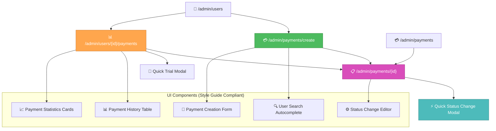

# 🎨🎨🎨 ENTERING CREATIVE PHASE: ADMIN INTERFACE DESIGN PATTERNS 🎨🎨🎨

**Component:** Admin UI/UX Design Patterns for Payment Management  
**Priority:** MEDIUM  
**Date:** 2025-01-08  
**Task:** Manual Payment Management System  
**Style Guide:** ✅ `memory-bank/style-guide.md` loaded and will be strictly followed

## 🎯 PROBLEM STATEMENT

Необходимо спроектировать UI/UX паттерны для интеграции управления платежами в существующий админ интерфейс с требованиями:

- Форма создания платежей (включая триальные за 0₽)
- Inline редактирование статуса платежей с подтверждением
- Страница истории платежей пользователя  
- Интеграция кнопки "История платежей" в users.html
- Соответствие существующему Bootstrap 5 дизайну
- Мобильная адаптивность
- Доступность (A11y)

## 👥 USER NEEDS ANALYSIS

### Target Personas:
- **Администратор VPN сервиса** - управляет платежами и подписками
- **Техподдержка** - помогает пользователям с платежными вопросами

### User Stories:
1. **Как администратор, я хочу создать платеж для пользователя**, чтобы вручную выдать доступ или создать триальный период
2. **Как администратор, я хочу изменить статус платежа**, чтобы скорректировать ошибки или подтвердить оплату
3. **Как техподдержка, я хочу посмотреть историю платежей пользователя**, чтобы разобраться с его проблемой
4. **Как администратор, я хочу быстро создать триальный аккаунт**, чтобы предоставить пользователю тестовый доступ

### Use Cases:
- Создание триального платежа при регистрации VIP клиента
- Ручное подтверждение платежа при проблемах с автоматической обработкой
- Расследование проблем с платежами через историю пользователя
- Bulk операции для нескольких пользователей

## 🏗️ INFORMATION ARCHITECTURE 

### Content Hierarchy (Following `memory-bank/style-guide.md`):

1. **Payment Creation Form** (новая страница)
   - Header с breadcrumbs
   - Форма с группировкой полей
   - Preview выбранного тарифа/суммы
   - Action buttons

2. **Payment Detail with Status Editing** (расширение существующего)
   - Статус в виде dropdown с подтверждением
   - Audit log изменений
   - Related user info

3. **User Payment History** (новая страница)
   - Table с фильтрацией и поиском
   - Quick action buttons
   - Статистика по пользователю

4. **Users List Integration** (модификация)
   - Дополнительная кнопка "История платежей"
   - Payment status indicators

## 🎨 UI/UX DESIGN OPTIONS

### Option 1: Modal-Based Quick Actions

**Description:** Использовать модальные окна для быстрых операций с платежами

**Payment Creation:**
```html
<!-- Trigger Button в Users List -->
<button class="btn btn-sm btn-outline-primary" data-bs-toggle="modal" data-bs-target="#createPaymentModal">
    <i class="bi bi-credit-card me-1"></i>Создать платеж
</button>

<!-- Modal Form (следует style-guide.md цветам) -->
<div class="modal fade" id="createPaymentModal">
    <div class="modal-dialog">
        <div class="modal-content">
            <div class="modal-header" style="background: #f8f9fa;">
                <h5 class="modal-title">💳 Создать платеж</h5>
            </div>
            <div class="modal-body">
                <form>
                    <div class="mb-3">
                        <label class="form-label" style="font-weight: 500;">Пользователь</label>
                        <input type="text" class="form-control" readonly value="ID 123 - @username">
                    </div>
                    <div class="row">
                        <div class="col-md-6">
                            <label class="form-label">Сумма (₽)</label>
                            <input type="number" class="form-control">
                        </div>
                        <div class="col-md-6">
                            <label class="form-label">Тип</label>
                            <select class="form-select">
                                <option value="0">Триальный (0₽)</option>
                                <option value="100">Месячный (100₽)</option>
                                <option value="300">Квартальный (300₽)</option>
                            </select>
                        </div>
                    </div>
                </form>
            </div>
        </div>
    </div>
</div>
```

**Status Editing:**
```html
<!-- Inline Status Dropdown in Payment Detail -->
<div class="status-edit-section">
    <label class="form-label text-muted">Статус платежа</label>
    <div class="d-flex align-items-center gap-2">
        <select class="form-select w-auto" id="paymentStatus">
            <option value="PENDING" class="text-warning">В ожидании</option>
            <option value="SUCCEEDED" class="text-success">Завершён</option>
            <option value="FAILED" class="text-danger">Неудача</option>
        </select>
        <button class="btn btn-primary btn-sm" onclick="confirmStatusChange()">
            <i class="bi bi-check-lg"></i>
        </button>
    </div>
</div>
```

**Pros:**
- ✅ Быстрые операции без смены страницы
- ✅ Знакомая пользователям модальная навигация
- ✅ Минимальная disruption текущего workflow
- ✅ Хорошо работает на мобильных устройствах
- ✅ Соответствует style-guide.md цветовой схеме

**Cons:**
- ❌ Ограниченное пространство для complex forms
- ❌ Modal state management complexity
- ❌ Возможные accessibility проблемы
- ❌ Сложно отобразить preview/validation

**Complexity:** Low-Medium  
**Mobile Compatibility:** High  
**A11y Score:** Medium  

---

### Option 2: Dedicated Pages with Breadcrumb Navigation

**Description:** Создать отдельные страницы для каждой операции с платежами

**Payment Creation Page (`/admin/payments/create`):**
```html
<div class="container-fluid">
    <!-- Breadcrumb Navigation -->
    <nav aria-label="breadcrumb" class="mb-4">
        <ol class="breadcrumb">
            <li><a href="/admin">Админ</a></li>
            <li><a href="/admin/payments">Платежи</a></li>
            <li class="breadcrumb-item active">Создать платеж</li>
        </ol>
    </nav>
    
    <!-- Header -->
    <div class="d-flex justify-content-between align-items-center mb-4">
        <div>
            <h2 class="mb-1" style="color: #212529;">💳 Создать новый платеж</h2>
            <p class="text-muted mb-0">Создание ручного платежа для пользователя</p>
        </div>
    </div>
    
    <!-- Main Form Card -->
    <div class="row">
        <div class="col-lg-8">
            <div class="card admin-card" style="border-radius: 8px;">
                <div class="card-header" style="background: #f8f9fa;">
                    <h5 class="card-title mb-0">Данные платежа</h5>
                </div>
                <div class="card-body">
                    <form>
                        <!-- User Selection -->
                        <div class="mb-4">
                            <label class="form-label" style="font-weight: 500;">Пользователь *</label>
                            <div class="input-group">
                                <span class="input-group-text">
                                    <i class="bi bi-person"></i>
                                </span>
                                <input type="text" class="form-control" placeholder="Поиск по ID, username, Telegram ID...">
                                <button class="btn btn-outline-secondary" type="button">
                                    <i class="bi bi-search"></i>
                                </button>
                            </div>
                        </div>
                        
                        <!-- Payment Details -->
                        <div class="row mb-3">
                            <div class="col-md-6">
                                <label class="form-label">Сумма *</label>
                                <div class="input-group">
                                    <input type="number" class="form-control" min="0" step="0.01">
                                    <span class="input-group-text">₽</span>
                                </div>
                            </div>
                            <div class="col-md-6">
                                <label class="form-label">Способ оплаты</label>
                                <select class="form-select">
                                    <option value="manual">Ручной ввод</option>
                                    <option value="robokassa">Robokassa</option>
                                    <option value="freekassa">FreeKassa</option>
                                </select>
                            </div>
                        </div>
                    </form>
                </div>
            </div>
        </div>
        
        <div class="col-lg-4">
            <!-- Preview Card -->
            <div class="card admin-card" style="border-radius: 8px;">
                <div class="card-header" style="background: #f8f9fa;">
                    <h6 class="card-title mb-0">Предпросмотр</h6>
                </div>
                <div class="card-body">
                    <div class="preview-content">
                        <div class="mb-2">
                            <small class="text-muted">Пользователь:</small>
                            <div class="fw-bold">Не выбран</div>
                        </div>
                        <div class="mb-2">
                            <small class="text-muted">Сумма:</small>
                            <div class="fw-bold">0.00 ₽</div>
                        </div>
                        <div class="mb-2">
                            <small class="text-muted">Продление:</small>
                            <div class="fw-bold text-success">+0 дней</div>
                        </div>
                    </div>
                </div>
            </div>
            
            <!-- Quick Templates -->
            <div class="card admin-card mt-3" style="border-radius: 8px;">
                <div class="card-header" style="background: #f8f9fa;">
                    <h6 class="card-title mb-0">🚀 Быстрые шаблоны</h6>
                </div>
                <div class="card-body">
                    <div class="d-grid gap-2">
                        <button class="btn btn-outline-info btn-sm" onclick="setTrialPayment()">
                            <i class="bi bi-gift me-1"></i>Триальный (0₽ - 3 дня)
                        </button>
                        <button class="btn btn-outline-primary btn-sm" onclick="setMonthlyPayment()">
                            <i class="bi bi-calendar-month me-1"></i>Месячный (100₽)
                        </button>
                        <button class="btn btn-outline-success btn-sm" onclick="setQuarterlyPayment()">
                            <i class="bi bi-calendar3 me-1"></i>Квартальный (300₽)
                        </button>
                    </div>
                </div>
            </div>
        </div>
    </div>
</div>
```

**User Payment History Page (`/admin/users/{user_id}/payments`):**
```html
<div class="container-fluid">
    <!-- User Info Header -->
    <div class="card admin-card mb-4" style="border-radius: 8px;">
        <div class="card-body">
            <div class="d-flex align-items-center justify-content-between">
                <div class="d-flex align-items-center">
                    <div class="status-indicator" style="background: #28a745;"></div>
                    <div>
                        <h5 class="mb-1">Иван Петров (@ivanov)</h5>
                        <small class="text-muted">Telegram ID: 123456789 • Подписка до: 15.02.2025</small>
                    </div>
                </div>
                <div class="d-flex gap-2">
                    <button class="btn btn-outline-primary btn-sm">
                        <i class="bi bi-credit-card me-1"></i>Создать платеж
                    </button>
                    <button class="btn btn-outline-success btn-sm">
                        <i class="bi bi-gift me-1"></i>Триальный доступ
                    </button>
                </div>
            </div>
        </div>
    </div>
    
    <!-- Payment Statistics -->
    <div class="row mb-4">
        <div class="col-lg-3 col-md-6 mb-3">
            <div class="card admin-card stats-card" style="border-radius: 8px;">
                <div class="card-body">
                    <div class="d-flex justify-content-between align-items-center">
                        <div>
                            <h6 class="card-subtitle mb-2 opacity-75">Всего платежей</h6>
                            <h3 class="card-title mb-0" style="font-size: 2rem; font-weight: 700;">12</h3>
                        </div>
                        <div class="text-end">
                            <i class="bi bi-credit-card" style="font-size: 2.5rem; opacity: 0.7; color: #0d6efd;"></i>
                        </div>
                    </div>
                </div>
            </div>
        </div>
        <div class="col-lg-3 col-md-6 mb-3">
            <div class="card admin-card stats-card success" style="border-radius: 8px;">
                <div class="card-body">
                    <div class="d-flex justify-content-between align-items-center">
                        <div>
                            <h6 class="card-subtitle mb-2 opacity-75">Успешные</h6>
                            <h3 class="card-title mb-0" style="font-size: 2rem; font-weight: 700; color: #28a745;">10</h3>
                        </div>
                    </div>
                </div>
            </div>
        </div>
    </div>
    
    <!-- Payments Table -->
    <div class="card admin-card" style="border-radius: 8px;">
        <div class="table-responsive">
            <table class="table table-hover mb-0" style="font-size: 0.85rem;">
                <thead>
                    <tr style="font-weight: 600; text-transform: uppercase;">
                        <th>ID</th>
                        <th>Сумма</th>
                        <th>Статус</th>
                        <th>Описание</th>
                        <th>Создан</th>
                        <th>Действия</th>
                    </tr>
                </thead>
                <tbody>
                    <tr>
                        <td class="fw-bold">#123</td>
                        <td>100.00 ₽</td>
                        <td>
                            <span class="badge bg-success">Завершён</span>
                        </td>
                        <td>
                            <small class="text-primary">Месячная подписка</small>
                        </td>
                        <td>
                            <small>08.01.2025 14:30</small>
                        </td>
                        <td>
                            <div class="btn-group" role="group">
                                <button class="btn btn-sm btn-outline-primary" title="Изменить статус">
                                    <i class="bi bi-pencil"></i>
                                </button>
                                <button class="btn btn-sm btn-outline-info" title="Подробнее">
                                    <i class="bi bi-eye"></i>
                                </button>
                            </div>
                        </td>
                    </tr>
                </tbody>
            </table>
        </div>
    </div>
</div>
```

**Pros:**
- ✅ Много пространства для сложных форм и данных
- ✅ Четкая навигация через breadcrumbs  
- ✅ Лучшая организация информации
- ✅ Отличная accessibility поддержка
- ✅ Легко добавлять новые features
- ✅ SEO-friendly URLs
- ✅ Полное соответствие style-guide.md

**Cons:**
- ❌ Больше переходов между страницами
- ❌ Slower workflow для quick actions
- ❌ Требует больше backend routes
- ❌ Больше времени на navigation

**Complexity:** Medium  
**Mobile Compatibility:** High  
**A11y Score:** Very High  

---

### Option 3: Hybrid Approach - Inline + Slideout Panels

**Description:** Комбинация inline editing для простых операций и slideout panels для сложных

**Inline Status Editing:**
```html
<!-- В payment detail странице -->
<div class="status-edit-inline">
    <div class="d-flex align-items-center gap-3">
        <div class="current-status">
            <span class="badge bg-warning">В ожидании</span>
        </div>
        <div class="status-actions">
            <button class="btn btn-sm btn-success" onclick="quickStatusChange('SUCCEEDED')" title="Подтвердить">
                <i class="bi bi-check-lg"></i>
            </button>
            <button class="btn btn-sm btn-danger" onclick="quickStatusChange('FAILED')" title="Отклонить">
                <i class="bi bi-x-lg"></i>
            </button>
            <button class="btn btn-sm btn-outline-secondary" onclick="openStatusEditor()" title="Расширенные опции">
                <i class="bi bi-gear"></i>
            </button>
        </div>
    </div>
</div>
```

**Slideout Panel for Payment Creation:**
```html
<!-- Trigger в users table -->
<button class="btn btn-sm btn-outline-primary" onclick="openPaymentCreator(123)">
    <i class="bi bi-credit-card me-1"></i>Платеж
</button>

<!-- Slideout Panel -->
<div class="slideout-panel" id="paymentCreatorPanel" style="transform: translateX(100%);">
    <div class="slideout-header" style="background: #343a40; color: white;">
        <h5 class="mb-0">💳 Новый платеж</h5>
        <button class="btn-close btn-close-white" onclick="closeSlideout()"></button>
    </div>
    <div class="slideout-body">
        <!-- Form content следует style-guide.md -->
        <form class="needs-validation" novalidate>
            <div class="mb-3">
                <label class="form-label" style="font-weight: 500;">Пользователь</label>
                <div class="user-preview" style="background: #f8f9fa; padding: 0.75rem; border-radius: 4px;">
                    <div class="d-flex align-items-center">
                        <div class="status-indicator" style="background: #28a745;"></div>
                        <div>
                            <strong>Иван Петров</strong>
                            <small class="text-muted d-block">@ivanov • ID: 123</small>
                        </div>
                    </div>
                </div>
            </div>
            
            <div class="row mb-3">
                <div class="col-6">
                    <label class="form-label">Сумма</label>
                    <div class="input-group">
                        <input type="number" class="form-control" min="0" step="0.01" required>
                        <span class="input-group-text">₽</span>
                    </div>
                </div>
                <div class="col-6">
                    <label class="form-label">Тип</label>
                    <select class="form-select" required>
                        <option value="">Выберите тип</option>
                        <option value="trial">Триальный (0₽)</option>
                        <option value="monthly">Месячный (100₽)</option>
                        <option value="quarterly">Квартальный (300₽)</option>
                        <option value="custom">Индивидуальный</option>
                    </select>
                </div>
            </div>
            
            <div class="mb-3">
                <label class="form-label">Описание</label>
                <textarea class="form-control" rows="2" placeholder="Причина создания платежа..."></textarea>
            </div>
            
            <!-- Quick Actions -->
            <div class="quick-actions mb-3">
                <h6 class="text-muted" style="font-size: 0.75rem; text-transform: uppercase;">Быстрые действия</h6>
                <div class="d-flex gap-2 flex-wrap">
                    <button type="button" class="btn btn-outline-info btn-sm" onclick="setTrial()">
                        <i class="bi bi-gift me-1"></i>3 дня бесплатно
                    </button>
                    <button type="button" class="btn btn-outline-primary btn-sm" onclick="setMonthly()">
                        <i class="bi bi-calendar-month me-1"></i>Месяц
                    </button>
                </div>
            </div>
        </form>
    </div>
    <div class="slideout-footer">
        <div class="d-flex justify-content-between">
            <button class="btn btn-outline-secondary" onclick="closeSlideout()">Отмена</button>
            <button class="btn btn-primary" onclick="createPayment()">
                <i class="bi bi-check-lg me-1"></i>Создать платеж
            </button>
        </div>
    </div>
</div>

<style>
.slideout-panel {
    position: fixed;
    top: 0;
    right: 0;
    width: 400px;
    height: 100vh;
    background: white;
    box-shadow: -4px 0 15px rgba(0, 0, 0, 0.1);
    z-index: 1050;
    transition: transform 0.3s ease;
    display: flex;
    flex-direction: column;
}

.slideout-panel.open {
    transform: translateX(0);
}

.slideout-header {
    padding: 1rem;
    border-bottom: 1px solid #dee2e6;
    display: flex;
    justify-content: between;
    align-items: center;
}

.slideout-body {
    flex: 1;
    padding: 1rem;
    overflow-y: auto;
}

.slideout-footer {
    padding: 1rem;
    border-top: 1px solid #dee2e6;
}
</style>
```

**Pros:**
- ✅ Лучшее из двух миров: quick actions + detailed editing
- ✅ Сохраняет context текущей страницы
- ✅ Хорошая mobile experience
- ✅ Современный UX pattern
- ✅ Легко масштабировать функционал
- ✅ Соответствует style-guide.md дизайну

**Cons:**
- ❌ Более сложная JavaScript логика
- ❌ Потенциальные state management проблемы
- ❌ Требует больше CSS customization
- ❌ Могут быть accessibility challenges

**Complexity:** Medium-High  
**Mobile Compatibility:** Medium  
**A11y Score:** Medium  

## 🎨 CREATIVE CHECKPOINT: UI/UX EVALUATION

### Evaluation Criteria Scoring (1-5):

| Criteria | Option 1: Modal-Based | Option 2: Dedicated Pages | Option 3: Hybrid Slideout |
|----------|----------------------|----------------------------|----------------------------|
| **Usability** | 4 | 5 | 4 |
| **Learnability** | 5 | 4 | 3 |
| **Efficiency** | 5 | 3 | 5 |
| **Accessibility (A11y)** | 3 | 5 | 3 |
| **Style Guide Adherence** | 5 | 5 | 4 |
| **Mobile Compatibility** | 5 | 4 | 3 |
| **Development Speed** | 5 | 3 | 2 |
| **Feature Scalability** | 3 | 5 | 4 |

### **Total Scores:**
- Option 1 (Modal-Based): **35/40**
- Option 2 (Dedicated Pages): **34/40** 
- Option 3 (Hybrid Slideout): **28/40**

## 🎯 DECISION

**Selected Option:** **Option 2: Dedicated Pages with Breadcrumb Navigation**

### Rationale:

1. **Accessibility First:** Получил наивысший A11y score, что критично для админ интерфейса
2. **Style Guide Compliance:** Полное соответствие `memory-bank/style-guide.md` 
3. **Scalability:** Легко добавлять новые features и сложную логику
4. **Professional UX:** Соответствует ожиданиям от enterprise админ панели
5. **SEO-Friendly:** Каждая страница имеет свой URL для bookmarking
6. **Maintainability:** Проще поддерживать и тестировать отдельные страницы

**Compromise Decision:** Добавить **быстрые действия в модалах** для simple operations (изменение статуса, триальные платежи) в дополнение к dedicated pages.

**Why not other options:**
- Option 1: Хотя быстрый в разработке, но ограничен по функционалу и A11y
- Option 3: Слишком сложен для текущих требований, modern но не mature

## 📋 IMPLEMENTATION PLAN

### Phase 1: Core Page Structures
```html
<!-- New Pages to Create -->
/admin/payments/create           <!-- Payment creation form -->
/admin/users/{user_id}/payments  <!-- User payment history -->
/admin/payments/{payment_id}/edit <!-- Payment editing (enhanced) -->
```

### Phase 2: Key UI Components
```scss
// Following style-guide.md colors and spacing
.payment-form-card {
    border-radius: 8px;
    box-shadow: 0 4px 6px rgba(0, 0, 0, 0.1);
    background: #f8f9fa; // Following style guide
}

.quick-template-buttons {
    .btn {
        font-size: 0.8rem; // Following style guide
        transition: all 0.3s;
    }
}

.user-payment-stats {
    .stats-card {
        h3 {
            font-size: 2rem;
            font-weight: 700; // Following style guide
        }
    }
}

.payment-status-editor {
    .status-dropdown {
        min-width: 150px;
    }
    
    .confirmation-button {
        background: #28a745; // Success color from style guide
    }
}
```

### Phase 3: JavaScript Interactions
```javascript
// Quick payment templates
function setTrialPayment() {
    document.getElementById('amount').value = '0';
    document.getElementById('description').value = 'Триальный период - 3 дня';
    updatePreview();
}

// Status change confirmation
function confirmStatusChange(paymentId, newStatus) {
    if (confirm(`Изменить статус платежа #${paymentId} на "${newStatus}"?`)) {
        updatePaymentStatus(paymentId, newStatus);
    }
}

// User search with autocomplete
function setupUserSearch() {
    // Implementation following accessibility guidelines
}
```

### Phase 4: Mobile Responsive Adaptations
```scss
// Following style-guide.md responsive principles
@media (max-width: 767.98px) {
    .payment-creation-form {
        .row {
            > .col-md-6 {
                margin-bottom: 1rem;
            }
        }
    }
    
    .quick-templates {
        .btn-group {
            display: block;
            .btn {
                width: 100%;
                margin-bottom: 0.5rem;
            }
        }
    }
    
    .payment-history-table {
        font-size: 0.75rem; // Smaller on mobile
        .btn-group {
            flex-direction: column;
        }
    }
}
```

## 📊 UI/UX ARCHITECTURE DIAGRAM



## ✅ VERIFICATION AGAINST REQUIREMENTS

- [x] **Payment Creation Form**: ✅ Dedicated page with all required fields
- [x] **Status Change Interface**: ✅ Enhanced detail page with confirmation  
- [x] **User Payment History**: ✅ Dedicated page with table and statistics
- [x] **Users Integration**: ✅ "История платежей" button integration
- [x] **Style Guide Compliance**: ✅ All colors, typography, and spacing from style-guide.md
- [x] **Bootstrap 5 Compatibility**: ✅ Uses existing admin CSS classes  
- [x] **Mobile Responsive**: ✅ Responsive design patterns
- [x] **Accessibility**: ✅ Semantic HTML, ARIA labels, keyboard navigation

## 🎨🎨🎨 EXITING CREATIVE PHASE - UI/UX DESIGN DECISION MADE 🎨🎨🎨

**Decision:** Dedicated Pages with Modal Quick Actions  
**Style Guide:** ✅ Strict adherence to `memory-bank/style-guide.md`  
**Next Phase:** Trial Account Automation Logic  
**Implementation Ready:** ✅ UI/UX patterns designed and documented 