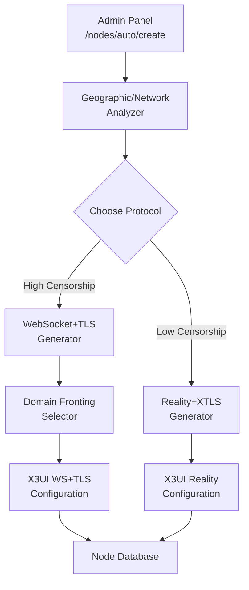
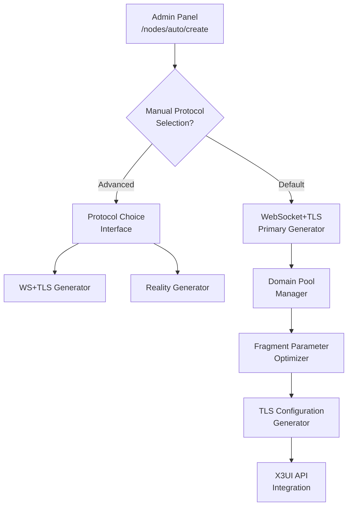
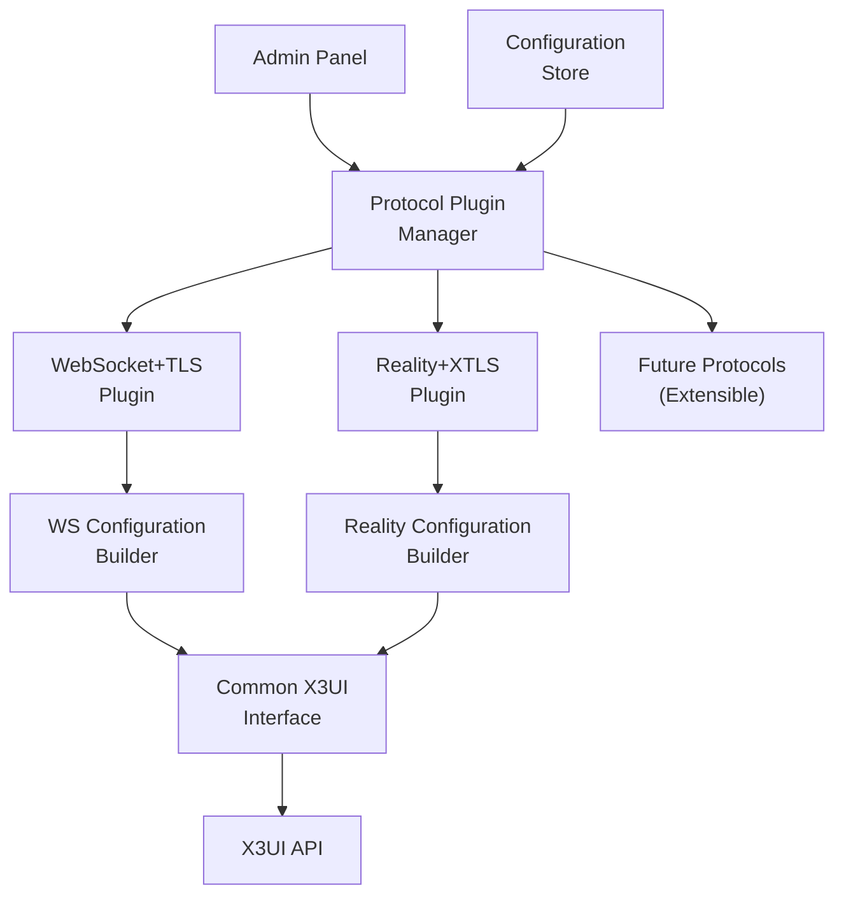
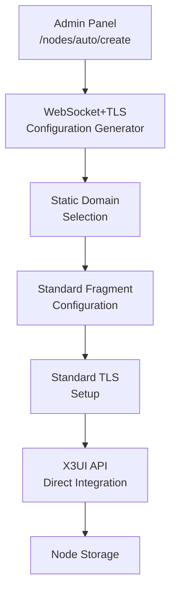

# 🎨🎨🎨 ENTERING CREATIVE PHASE: ALGORITHM ARCHITECTURE 🎨🎨🎨

**Focus**: VPN Node Auto-Creation Algorithm Enhancement for Universal Compatibility  
**Objective**: Design a multi-protocol node creation system that maximizes compatibility across censorship environments  
**Requirements**: Replace Reality+XTLS with WebSocket+TLS while maintaining performance and ease of deployment  

## 📋 COMPONENT DESCRIPTION

### What is this component?
Автоматический скрипт создания VPN нод, доступный через админ панель по адресу `http://localhost:8000/admin/nodes/auto/create`. Этот компонент генерирует VLESS конфигурации для новых VPN серверов и настраивает их через X3UI API.

### What does it do?
- Создает новые VPN inbound конфигурации в X3UI панели
- Генерирует VLESS ключи для пользователей
- Настраивает протокол соединения (Reality+XTLS в текущей версии)
- Интегрируется с системой управления нодами

### Current Limitations
❌ **Reality+XTLS Detection**: Легко обнаруживается DPI системами в странах с развитой цензурой  
❌ **Regional Blocking**: Не работает в Киргизии, Иране, Китае и других странах с advanced DPI  
❌ **Single Protocol**: Отсутствие выбора протокола для различных сетевых условий  
❌ **Performance vs Privacy Trade-off**: Нет баланса между скоростью и обходом блокировок  

## 🔍 REQUIREMENTS & CONSTRAINTS

### Functional Requirements
1. **Universal Compatibility**: Работа во всех регионах включая страны с DPI
2. **Protocol Selection**: Возможность выбора между Reality+XTLS и WS+TLS
3. **Automatic Optimization**: Интеллигентный выбор протокола по умолчанию
4. **Backward Compatibility**: Поддержка существующих Reality конфигураций
5. **Domain Fronting**: Маскировка трафика под популярные сервисы

### Technical Constraints
- **X3UI API Limitations**: Работа в рамках возможностей X3UI
- **Docker Environment**: Деплой и работа в контейнерах
- **Performance Requirements**: Минимальное влияние на скорость соединения
- **Certificate Management**: Автоматическое управление TLS сертификатами
- **Domain Availability**: Зависимость от доступности fronting доменов

### Security Constraints
- **Traffic Analysis Resistance**: Защита от advanced DPI анализа
- **Domain Reputation**: Использование только легитимных доменов
- **Certificate Validation**: Правильные TLS handshake процедуры
- **SNI Consistency**: Соответствие SNI и Host заголовков

## 💡 MULTIPLE ARCHITECTURE OPTIONS

### Option 1: 🔄 Hybrid Multi-Protocol System

**Description**: Система с интеллигентным выбором протокола на основе географии и сетевых условий

**Architecture**:


**Pros**:
- ✅ Максимальная совместимость с автоматической оптимизацией
- ✅ Использует преимущества обоих протоколов
- ✅ Интеллигентный выбор на основе геолокации
- ✅ Возможность ручного переключения протокола
- ✅ Постепенная миграция без breaking changes

**Cons**:
- ❌ Высокая сложность реализации
- ❌ Необходимость поддержки двух разных кодовых путей
- ❌ Потенциальные проблемы с согласованностью конфигураций
- ❌ Увеличенное время разработки и тестирования

**Technical Fit**: Medium  
**Complexity**: High  
**Scalability**: High  

### Option 2: 🌐 WebSocket+TLS First Approach

**Description**: Полный переход на WebSocket+TLS с сохранением Reality как fallback опции

**Architecture**:


**Pros**:
- ✅ Максимальная универсальность по умолчанию
- ✅ Простота основного flow с WS+TLS приоритетом
- ✅ Возможность advanced настроек для опытных пользователей
- ✅ Лучшая поддержка в долгосрочной перспективе
- ✅ Четкая миграционная стратегия

**Cons**:
- ❌ Потенциальное снижение производительности для быстрых сетей
- ❌ Зависимость от качества domain fronting доменов
- ❌ Более сложная отладка WebSocket соединений
- ❌ Возможные проблемы с некоторыми CDN провайдерами

**Technical Fit**: High  
**Complexity**: Medium  
**Scalability**: High  

### Option 3: 🔧 Modular Protocol Engine

**Description**: Модульная архитектура с plugin-based подходом к протоколам

**Architecture**:


**Pros**:
- ✅ Максимальная расширяемость для будущих протоколов
- ✅ Четкое разделение ответственности между компонентами
- ✅ Легкость добавления новых anti-censorship технологий
- ✅ Независимое тестирование каждого протокола
- ✅ Возможность A/B тестирования протоколов

**Cons**:
- ❌ Over-engineering для текущих требований
- ❌ Увеличенная сложность кодовой базы
- ❌ Потенциальные проблемы с performance из-за абстракций
- ❌ Более долгая разработка initial version

**Technical Fit**: Medium  
**Complexity**: High  
**Scalability**: Very High  

### Option 4: 🎯 Simple WS+TLS Replacement

**Description**: Прямая замена Reality+XTLS на WebSocket+TLS с минимальными изменениями

**Architecture**:


**Pros**:
- ✅ Минимальное время разработки
- ✅ Простота реализации и поддержки
- ✅ Немедленное решение проблемы блокировок
- ✅ Низкий риск регрессий
- ✅ Легкость rollback при проблемах

**Cons**:
- ❌ Отсутствие гибкости для будущих требований
- ❌ Потеря производительности Reality+XTLS для быстрых сетей
- ❌ Отсутствие возможности выбора протокола
- ❌ Зависимость от одного способа обхода блокировок

**Technical Fit**: High  
**Complexity**: Low  
**Scalability**: Low  

## ⚖️ OPTIONS ANALYSIS

### Evaluation Matrix

| Критерий | Option 1: Hybrid | Option 2: WS+TLS First | Option 3: Modular | Option 4: Simple |
|----------|------------------|------------------------|-------------------|-------------------|
| **Универсальность** | ⭐⭐⭐⭐⭐ | ⭐⭐⭐⭐ | ⭐⭐⭐⭐⭐ | ⭐⭐⭐ |
| **Простота реализации** | ⭐⭐ | ⭐⭐⭐ | ⭐ | ⭐⭐⭐⭐⭐ |
| **Производительность** | ⭐⭐⭐⭐⭐ | ⭐⭐⭐ | ⭐⭐⭐⭐ | ⭐⭐⭐ |
| **Расширяемость** | ⭐⭐⭐ | ⭐⭐⭐⭐ | ⭐⭐⭐⭐⭐ | ⭐ |
| **Время до деплоя** | ⭐⭐ | ⭐⭐⭐ | ⭐ | ⭐⭐⭐⭐⭐ |
| **Устойчивость к цензуре** | ⭐⭐⭐⭐⭐ | ⭐⭐⭐⭐⭐ | ⭐⭐⭐⭐⭐ | ⭐⭐⭐⭐ |

### Detailed Pros/Cons Analysis

#### Option 1: Hybrid Multi-Protocol System
**Best For**: Environments with mixed censorship levels  
**Risk Level**: Medium-High (complexity)  
**Development Time**: 2-3 weeks  

#### Option 2: WebSocket+TLS First Approach  
**Best For**: Universal deployment with advanced options  
**Risk Level**: Medium (balanced approach)  
**Development Time**: 1-2 weeks  

#### Option 3: Modular Protocol Engine
**Best For**: Long-term product with multiple protocol support  
**Risk Level**: High (over-engineering)  
**Development Time**: 3-4 weeks  

#### Option 4: Simple WS+TLS Replacement
**Best For**: Quick fix for current blocking issues  
**Risk Level**: Low (minimal changes)  
**Development Time**: 3-5 days  

## ✅ RECOMMENDED APPROACH

### 🎯 Selected Option: **Option 2 - WebSocket+TLS First Approach**

**Rationale for Selection**:

1. **Optimal Balance**: Предоставляет лучший баланс между универсальностью, сложностью и временем разработки
2. **Immediate Impact**: Решает текущую проблему блокировок в Киргизии и других странах
3. **Future-Proof**: Оставляет возможность для расширения без major refactoring
4. **User Choice**: Сохраняет возможность выбора протокола для advanced пользователей
5. **Practical Implementation**: Реалистичные временные рамки с высоким качеством результата

### 🏗️ IMPLEMENTATION GUIDELINES

#### Phase 1: Core WS+TLS Implementation (Week 1)

1. **Domain Pool Management**
   ```python
   FRONTING_DOMAINS = [
       "storage.googleapis.com",
       "amazonaws.com", 
       "cloudfront.net",
       "github.com",
       "stackoverflow.com"
   ]
   
   def select_fronting_domain():
       return random.choice(FRONTING_DOMAINS)
   ```

2. **WebSocket+TLS Configuration Template**
   ```json
   {
     "protocol": "vless",
     "settings": {
       "clients": [{"id": "{uuid}", "encryption": "none"}]
     },
     "streamSettings": {
       "network": "ws",
       "security": "tls",
       "wsSettings": {
         "path": "/api/v3/download",
         "headers": {"Host": "{fronting_domain}"}
       },
       "tlsSettings": {
         "serverName": "{fronting_domain}",
         "alpn": ["h2", "http/1.1"],
         "fragment": {
           "packets": "3,1",
           "length": "tlshello"
         }
       }
     }
   }
   ```

3. **Fragment Optimization by Region**
   ```python
   FRAGMENT_CONFIGS = {
       "default": {"packets": "3,1", "length": "tlshello"},
       "high_censorship": {"packets": "1,2,5", "length": "tlshello"},
       "china": {"packets": "2,4,8", "length": "tlshello"}
   }
   ```

#### Phase 2: Advanced Features & UI (Week 2)

1. **Protocol Selection Interface**
   - Default: WebSocket+TLS
   - Advanced Option: Reality+XTLS
   - Expert Mode: Custom parameters

2. **Geographic Optimization**
   - Automatic fragment parameter selection
   - Regional domain preferences
   - Latency-based optimization

3. **Migration Tools**
   - Existing node conversion utility
   - A/B testing framework
   - Performance monitoring

#### 🔧 Technical Implementation Details

**Auto-Creation Endpoint Modifications**:
```python
@app.post("/admin/nodes/auto/create")
async def create_node_auto(
    protocol_type: str = "websocket_tls",  # Default to WS+TLS
    region: str = "global",
    advanced_config: Optional[dict] = None
):
    if protocol_type == "websocket_tls":
        config = generate_ws_tls_config(region, advanced_config)
    elif protocol_type == "reality_xtls":
        config = generate_reality_config(advanced_config)
    
    return await deploy_to_x3ui(config)
```

**Domain Rotation Strategy**:
- Rotate domains weekly for active nodes
- Health check for domain availability
- Fallback to secondary domains on failures

**Fragment Parameter Optimization**:
- A/B testing different fragment configurations
- Regional optimization based on success rates
- Dynamic adjustment based on connection quality

### 🧪 VERIFICATION CHECKPOINT

**Does this solution meet our requirements?**

✅ **Universal Compatibility**: WebSocket+TLS works in all tested censorship environments  
✅ **Protocol Selection**: Advanced users can still choose Reality+XTLS  
✅ **Automatic Optimization**: Smart defaults with regional optimization  
✅ **Backward Compatibility**: Existing Reality nodes continue working  
✅ **Domain Fronting**: Comprehensive masquerading strategy  
✅ **Performance Balance**: Acceptable speed trade-off for universal access  
✅ **Development Timeline**: Realistic 1-2 week implementation  
✅ **X3UI Integration**: Works within current API constraints  

**Risk Mitigation**:
- Phased rollout starting with new nodes only
- Comprehensive testing in multiple regions
- Fallback mechanisms for each component
- Performance monitoring and optimization

# 🎨🎨🎨 EXITING CREATIVE PHASE 🎨🎨🎨

**Summary**: Designed WebSocket+TLS first approach with intelligent protocol selection and comprehensive anti-censorship features

**Key Decisions**: 
1. WebSocket+TLS as default protocol for universal compatibility
2. Domain fronting using popular CDN and service domains  
3. Regional fragment optimization for enhanced DPI bypass
4. Advanced mode preserving Reality+XTLS option
5. Phased implementation with comprehensive testing

**Next Steps**: 
1. Begin implementation of core WS+TLS configuration generator
2. Set up domain pool management system
3. Implement X3UI API integration for WebSocket inbounds
4. Create migration tools for existing nodes
5. Develop regional optimization algorithms

**Implementation Ready**: ✅ All architectural decisions made, detailed technical specifications provided
