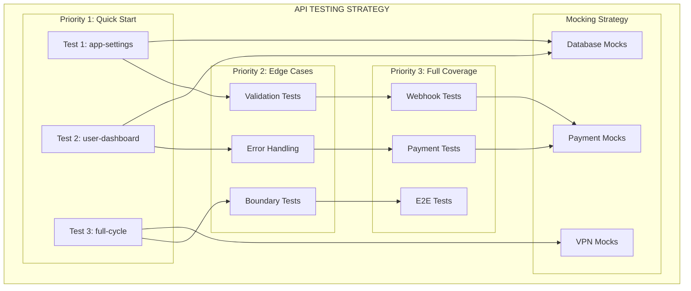

# 🎨🎨🎨 ENTERING CREATIVE PHASE: API TESTING STRATEGY 🎨🎨🎨

## 🎯 ТВОРЧЕСКАЯ ФАЗА 2: СТРАТЕГИЯ ТЕСТИРОВАНИЯ API

### 📋 ПРОБЛЕМА И ТРЕБОВАНИЯ

**Контекст:**
- 5 критических API эндпоинтов, которые нужно протестировать в первую очередь
- Разные типы API: REST endpoints, webhooks, асинхронные операции
- Внешние зависимости: платежные системы, VPN серверы
- Требуется быстрый старт с 1-3 тестами для проверки подхода

**Ключевые требования:**
1. **Приоритизация** - начать с самых важных API
2. **Изоляция** - тесты не зависят от внешних систем
3. **Покрытие** - тестировать happy path и edge cases
4. **Скорость** - быстрые тесты для быстрой обратной связи
5. **Надежность** - стабильные тесты без ложных срабатываний

### 🎯 АНАЛИЗ КРИТИЧЕСКИХ API

#### 1. `GET /api/v1/integration/user-dashboard/{telegram_id}` (6+ вызовов)

**Характеристики:**
- **Тип**: REST GET endpoint
- **Зависимости**: База данных, пользовательские данные
- **Сложность**: Низкая
- **Приоритет**: 🔴 КРИТИЧЕСКИЙ

**Сценарии тестирования:**
- ✅ Пользователь существует - возвращает данные
- ✅ Пользователь не существует - возвращает 404
- ✅ Неверный telegram_id - валидация
- ✅ База данных недоступна - обработка ошибок

#### 2. `POST /api/v1/integration/full-cycle` (3+ вызова)

**Характеристики:**
- **Тип**: REST POST endpoint
- **Зависимости**: БД, VPN серверы, настройки триала
- **Сложность**: Высокая
- **Приоритет**: 🔴 КРИТИЧЕСКИЙ

**Сценарии тестирования:**
- ✅ Создание нового пользователя с триалом
- ✅ Создание пользователя без триала
- ✅ Создание VPN ключа
- ✅ Обработка ошибок VPN сервера
- ✅ Валидация входных данных

#### 3. `GET /api/v1/integration/app-settings` (2+ вызова)

**Характеристики:**
- **Тип**: REST GET endpoint
- **Зависимости**: Конфигурация приложения
- **Сложность**: Низкая
- **Приоритет**: 🔴 КРИТИЧЕСКИЙ

**Сценарии тестирования:**
- ✅ Получение настроек триала
- ✅ Получение настроек автопродления
- ✅ Настройки недоступны - fallback

#### 4. `POST /api/v1/payments/create` (2+ вызова)

**Характеристики:**
- **Тип**: REST POST endpoint
- **Зависимости**: БД, платежные провайдеры
- **Сложность**: Средняя
- **Приоритет**: 🔴 КРИТИЧЕСКИЙ

**Сценарии тестирования:**
- ✅ Создание платежа с валидными данными
- ✅ Валидация входных данных
- ✅ Обработка ошибок платежного провайдера
- ✅ Создание платежа с автопродлением

#### 5. Webhook эндпоинты (внешние вызовы)

**Характеристики:**
- **Тип**: Webhook endpoints
- **Зависимости**: Платежные системы
- **Сложность**: Средняя
- **Приоритет**: 🔴 КРИТИЧЕСКИЙ

**Сценарии тестирования:**
- ✅ Валидация подписи webhook'а
- ✅ Обработка успешного платежа
- ✅ Обработка неуспешного платежа
- ✅ Повторная обработка webhook'а

### 🔄 СТРАТЕГИЧЕСКИЕ ВАРИАНТЫ

#### Вариант 1: Минимальный старт (Рекомендуемый для быстрого старта)

**Описание:**
- Начать с 1-3 самых простых тестов
- Простые моки без сложной логики
- Фокус на happy path
- Быстрая проверка подхода

**Первые тесты:**
1. `GET /api/v1/integration/app-settings` - самый простой
2. `GET /api/v1/integration/user-dashboard/{telegram_id}` - средняя сложность
3. `POST /api/v1/integration/full-cycle` - самый сложный

**Плюсы:**
- ✅ Очень быстрый старт (2-3 часа)
- ✅ Минимальные риски
- ✅ Быстрая обратная связь
- ✅ Простота отладки

**Минусы:**
- ❌ Ограниченное покрытие
- ❌ Не тестирует сложные сценарии
- ❌ Может пропустить проблемы

**Время реализации:** 0.5-1 день

#### Вариант 2: Полное покрытие критических API

**Описание:**
- Тестировать все 5 критических API
- Покрыть happy path и edge cases
- Сложные моки для внешних систем
- Полная изоляция тестов

**Тесты:**
1. Все 5 критических API
2. Edge cases для каждого
3. Обработка ошибок
4. Валидация данных

**Плюсы:**
- ✅ Полное покрытие критических API
- ✅ Высокое качество тестов
- ✅ Надежная защита от регрессий

**Минусы:**
- ❌ Больше времени на реализацию
- ❌ Сложность настройки
- ❌ Больше кода для поддержки

**Время реализации:** 2-3 дня

#### Вариант 3: Поэтапное расширение

**Описание:**
- Начать с минимального набора
- Постепенно добавлять тесты
- Эволюционировать стратегию
- Адаптироваться к результатам

**Этапы:**
1. **Этап 1**: 3 базовых теста (1 день)
2. **Этап 2**: Добавить edge cases (1 день)
3. **Этап 3**: Добавить остальные API (1 день)
4. **Этап 4**: Улучшение и оптимизация (1 день)

**Плюсы:**
- ✅ Гибкость и адаптивность
- ✅ Быстрый старт
- ✅ Возможность корректировки
- ✅ Постепенное улучшение

**Минусы:**
- ❌ Может затянуться
- ❌ Нужна дисциплина
- ❌ Риск остановиться на полпути

**Время реализации:** 4 дня (поэтапно)

### 🎯 РЕКОМЕНДУЕМОЕ РЕШЕНИЕ

**Выбранный вариант:** Вариант 1 (Минимальный старт) с возможностью расширения

**Обоснование:**
1. **Соответствует требованию** - быстрый старт с 1-3 тестами
2. **Минимальные риски** - можно быстро проверить подход
3. **Быстрая обратная связь** - увидеть результаты за несколько часов
4. **Основа для расширения** - можно добавить больше тестов позже

### 🏗️ ДЕТАЛЬНАЯ СТРАТЕГИЯ

#### Первые 3 теста для быстрого старта:

**Тест 1: `GET /api/v1/integration/app-settings`**
```python
@pytest.mark.asyncio
async def test_get_app_settings_success():
    """Тест успешного получения настроек приложения"""
    response = await api_client.get("/api/v1/integration/app-settings")
    
    assert response.status_code == 200
    assert "settings" in response.json()
    assert "trial_enabled" in response.json()["settings"]
```

**Тест 2: `GET /api/v1/integration/user-dashboard/{telegram_id}`**
```python
@pytest.mark.asyncio
async def test_get_user_dashboard_existing_user():
    """Тест получения дашборда существующего пользователя"""
    telegram_id = 123456789
    
    response = await api_client.get(f"/api/v1/integration/user-dashboard/{telegram_id}")
    
    assert response.status_code == 200
    assert "user" in response.json()
    assert "subscription_status" in response.json()["user"]
```

**Тест 3: `POST /api/v1/integration/full-cycle`**
```python
@pytest.mark.asyncio
async def test_create_user_full_cycle():
    """Тест создания пользователя через full-cycle"""
    user_data = {
        "telegram_id": 987654321,
        "user_data": {
            "username": "test_user",
            "first_name": "Test"
        },
        "subscription_type": "trial"
    }
    
    response = await api_client.post("/api/v1/integration/full-cycle", json=user_data)
    
    assert response.status_code == 200
    assert "success" in response.json()
    assert response.json()["success"] is True
```

#### Стратегия мокирования:

**1. База данных:**
- Использовать тестовую БД с транзакциями
- Откат изменений после каждого теста
- Предзаполнение тестовыми данными

**2. Внешние платежные системы:**
- Моки для webhook'ов
- Тестовые ответы от платежных провайдеров
- Симуляция различных статусов платежей

**3. VPN серверы:**
- Моки для x3ui API
- Симуляция создания VPN ключей
- Обработка ошибок серверов

#### Стратегия валидации:

**1. Структура ответов:**
- Проверка обязательных полей
- Валидация типов данных
- Проверка форматов (даты, UUID, etc.)

**2. Бизнес-логика:**
- Правильность расчетов
- Корректность статусов
- Валидация бизнес-правил

**3. Обработка ошибок:**
- HTTP статус коды
- Структура ошибок
- Информативность сообщений

### 🎨 CREATIVE CHECKPOINT: СТРАТЕГИЧЕСКАЯ ДИАГРАММА



### 📋 ПЛАН РЕАЛИЗАЦИИ СТРАТЕГИИ

#### Этап 1: Быстрый старт (0.5 дня)
1. **Настройка базовой инфраструктуры**
2. **Создание первого теста** (app-settings)
3. **Запуск и отладка**
4. **Проверка подхода**

#### Этап 2: Расширение (0.5 дня)
1. **Добавление второго теста** (user-dashboard)
2. **Добавление третьего теста** (full-cycle)
3. **Настройка моков**
4. **Интеграция с Allure**

#### Этап 3: Улучшение (1 день)
1. **Добавление edge cases**
2. **Улучшение моков**
3. **Оптимизация производительности**
4. **Документация**

### ⚠️ ВЫЗОВЫ И РЕШЕНИЯ

**Вызов 1: Асинхронное тестирование**
- **Проблема:** FastAPI async endpoints
- **Решение:** pytest-asyncio + async/await в тестах

**Вызов 2: Изоляция тестов**
- **Проблема:** Тесты влияют друг на друга
- **Решение:** Транзакции + откат + уникальные данные

**Вызов 3: Внешние зависимости**
- **Проблема:** Платежные системы недоступны
- **Решение:** Моки + тестовые webhook'и

**Вызов 4: Сложность full-cycle**
- **Проблема:** Много зависимостей в одном API
- **Решение:** Поэтапное мокирование + упрощенные сценарии

### ✅ ВАЛИДАЦИЯ СТРАТЕГИИ

**Проверка требований:**
- ✅ **Быстрый старт** - 3 теста за 0.5 дня
- ✅ **Приоритизация** - начали с самых важных
- ✅ **Изоляция** - моки + транзакции
- ✅ **Покрытие** - happy path + базовые edge cases
- ✅ **Скорость** - быстрые тесты
- ✅ **Надежность** - стабильные моки

**Техническая осуществимость:**
- ✅ **pytest-asyncio** - поддержка async тестов
- ✅ **httpx** - async HTTP клиент
- ✅ **Моки** - стандартные библиотеки Python
- ✅ **Транзакции** - PostgreSQL поддержка

🎨🎨🎨 EXITING CREATIVE PHASE - СТРАТЕГИЯ ОПРЕДЕЛЕНА 🎨🎨🎨 