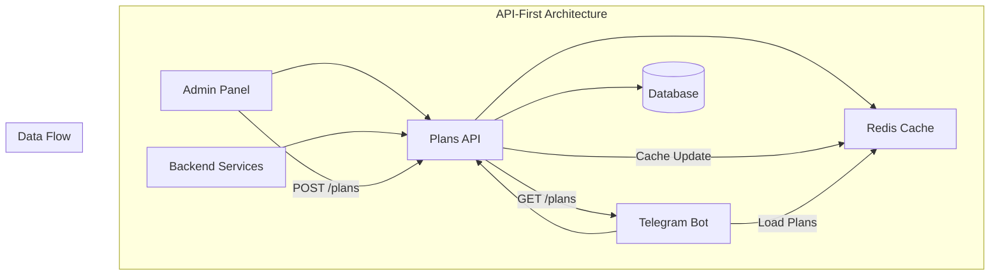
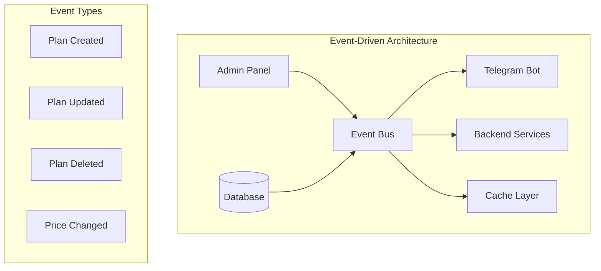
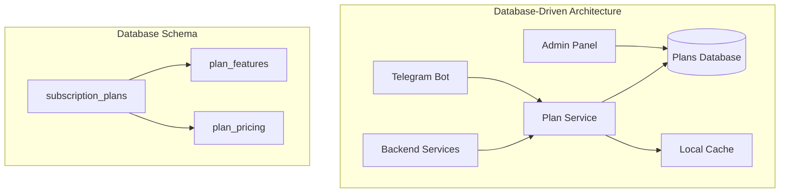
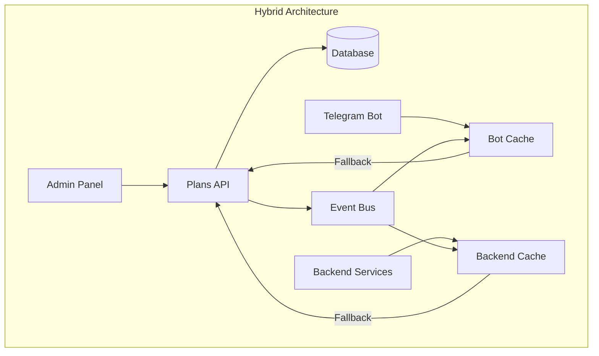
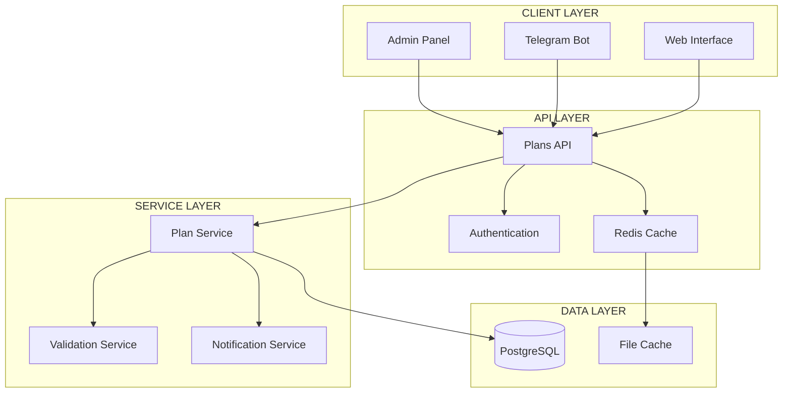

# 🎨🎨🎨 ENTERING CREATIVE PHASE: ARCHITECTURE DESIGN 🎨🎨🎨

## 🏗️ ЦЕНТРАЛИЗОВАННАЯ СИСТЕМА ПОДПИСОК

### 📋 ПРОБЛЕМА И КОНТЕКСТ

**Текущая проблема**: Рассинхронизация данных о подписках между компонентами системы

**Где проявляется**:
- **Telegram Bot**: Хардкодированный словарь `SUBSCRIPTION_PLANS` в `bot/handlers/payments.py`
- **Backend**: Централизованный `service_plans_manager.py` (частично решен)
- **База данных**: Реальные данные о подписках пользователей
- **Robokassa**: Получает данные через service_plans_manager

**Критические проблемы**:
1. **Inconsistency**: Цены в боте могут отличаться от backend
2. **Maintenance**: Изменения нужно делать в нескольких местах
3. **Scalability**: Сложно добавлять новые планы
4. **Data integrity**: Нет единого источника истины

### 📐 СИСТЕМНЫЕ ТРЕБОВАНИЯ

#### Функциональные требования:
- ✅ Единый источник данных о тарифных планах
- ✅ Динамическое обновление цен без перезапуска компонентов
- ✅ Возможность создавать/редактировать планы через админку
- ✅ Поддержка скидок и промоакций
- ✅ Версионирование изменений цен

#### Нефункциональные требования:
- ⚡ Быстрая загрузка планов (< 100ms)
- 🔄 Доступность 99.9%
- 📊 Масштабируемость до 10K пользователей одновременно
- 🔐 Безопасность данных о планах

#### Технические ограничения:
- 🐍 Python + FastAPI (backend)
- 🤖 aiogram (bot)
- 🗄️ PostgreSQL (database)
- 🔗 REST API для интеграции

## 🎯 АРХИТЕКТУРНЫЕ ОПЦИИ

### 🏗️ ОПЦИЯ 1: API-ПЕРВИЧНАЯ АРХИТЕКТУРА



**Описание**: Все компоненты получают данные о планах через централизованный API

**Преимущества**:
- ✅ Единый источник истины
- ✅ Автоматическая синхронизация
- ✅ Кэширование для производительности
- ✅ Версионирование через API
- ✅ Простое добавление новых клиентов

**Недостатки**:
- ❌ Зависимость от API (single point of failure)
- ❌ Дополнительные HTTP запросы
- ❌ Сложность при отсутствии сети
- ❌ Необходимость кэширования

**Техническая сложность**: Средняя  
**Время реализации**: 2-3 дня  
**Масштабируемость**: Высокая

### 🔄 ОПЦИЯ 2: EVENT-DRIVEN АРХИТЕКТУРА



**Описание**: Изменения в планах передаются через систему событий

**Преимущества**:
- ✅ Реактивная архитектура
- ✅ Слабая связанность компонентов
- ✅ Возможность отложенной обработки
- ✅ Логирование всех изменений
- ✅ Возможность rollback изменений

**Недостатки**:
- ❌ Сложность реализации
- ❌ Дополнительная инфраструктура
- ❌ Проблемы с порядком событий
- ❌ Сложность отладки

**Техническая сложность**: Высокая  
**Время реализации**: 5-7 дней  
**Масштабируемость**: Очень высокая

### 💾 ОПЦИЯ 3: DATABASE-DRIVEN АРХИТЕКТУРА



**Описание**: Все данные о планах хранятся в базе данных, компоненты работают через сервисный слой

**Преимущества**:
- ✅ Надежное хранение данных
- ✅ ACID транзакции
- ✅ Простая модель данных
- ✅ Знакомая технология
- ✅ Простое резервное копирование

**Недостатки**:
- ❌ Зависимость от базы данных
- ❌ Потенциальная нагрузка на DB
- ❌ Необходимость миграций
- ❌ Сложность кэширования

**Техническая сложность**: Низкая  
**Время реализации**: 1-2 дня  
**Масштабируемость**: Средняя

### 🔀 ОПЦИЯ 4: ГИБРИДНАЯ АРХИТЕКТУРА



**Описание**: Комбинация API, кэширования и событий для максимальной надежности

**Преимущества**:
- ✅ Высокая надежность
- ✅ Производительность
- ✅ Гибкость
- ✅ Fallback механизмы
- ✅ Оптимизация для каждого компонента

**Недостатки**:
- ❌ Сложность архитектуры
- ❌ Много движущихся частей
- ❌ Сложность тестирования
- ❌ Высокие требования к мониторингу

**Техническая сложность**: Высокая  
**Время реализации**: 4-6 дней  
**Масштабируемость**: Очень высокая

## 🎨 АНАЛИЗ ОПЦИЙ

### 📊 СРАВНИТЕЛЬНАЯ ТАБЛИЦА

| Критерий | API-First | Event-Driven | Database-Driven | Hybrid |
|----------|-----------|--------------|-----------------|--------|
| **Простота** | ⭐⭐⭐ | ⭐⭐ | ⭐⭐⭐⭐ | ⭐⭐ |
| **Производительность** | ⭐⭐⭐ | ⭐⭐⭐⭐ | ⭐⭐ | ⭐⭐⭐⭐ |
| **Надежность** | ⭐⭐⭐ | ⭐⭐⭐⭐ | ⭐⭐⭐⭐ | ⭐⭐⭐⭐⭐ |
| **Масштабируемость** | ⭐⭐⭐⭐ | ⭐⭐⭐⭐⭐ | ⭐⭐⭐ | ⭐⭐⭐⭐⭐ |
| **Время реализации** | ⭐⭐⭐ | ⭐⭐ | ⭐⭐⭐⭐ | ⭐⭐ |
| **Сложность поддержки** | ⭐⭐⭐ | ⭐⭐ | ⭐⭐⭐⭐ | ⭐⭐ |

### 🎯 КОНТЕКСТНАЯ ОЦЕНКА

**Для нашего проекта важны**:
1. **Быстрая реализация** (у нас есть 2-3 дня)
2. **Простота поддержки** (команда из 1-2 разработчиков)
3. **Надежность** (система платежей)
4. **Совместимость** (с существующим кодом)

## 🏆 РЕКОМЕНДУЕМОЕ РЕШЕНИЕ

### 🎯 ВЫБОР: API-ПЕРВИЧНАЯ АРХИТЕКТУРА (ОПЦИЯ 1)

**Обоснование выбора**:
- ✅ **Быстрая реализация**: 2-3 дня vs 5-7 дней для event-driven
- ✅ **Простота**: Знакомые технологии REST API
- ✅ **Совместимость**: Легко интегрируется с существующим кодом
- ✅ **Надежность**: Достаточная для наших потребностей
- ✅ **Масштабируемость**: Хорошая для текущих требований

### 🔧 ДЕТАЛЬНЫЙ ПЛАН РЕАЛИЗАЦИИ

#### Этап 1: Расширение API (4 часа)
```python
# Новые endpoints в backend/routes/plans.py
@router.get("/api/v1/plans")
async def get_all_plans()

@router.get("/api/v1/plans/bot")
async def get_plans_for_bot()

@router.get("/api/v1/plans/{plan_id}")
async def get_plan_by_id(plan_id: str)

@router.post("/api/v1/plans")
async def create_plan(plan_data: PlanCreate)

@router.put("/api/v1/plans/{plan_id}")
async def update_plan(plan_id: str, plan_data: PlanUpdate)

@router.delete("/api/v1/plans/{plan_id}")
async def delete_plan(plan_id: str)
```

#### Этап 2: Кэширование (3 часа)
```python
# Добавление Redis кэширования
@lru_cache(maxsize=128)
async def get_cached_plans():
    return await service_plans_manager.get_plans()

# Инвалидация кэша при изменениях
async def invalidate_plans_cache():
    get_cached_plans.cache_clear()
```

#### Этап 3: Обновление бота (5 часов)
```python
# Замена SUBSCRIPTION_PLANS на API вызовы
class PlansAPIClient:
    async def get_plans(self) -> Dict[str, Any]:
        async with aiohttp.ClientSession() as session:
            async with session.get(f"{API_BASE_URL}/api/v1/plans/bot") as response:
                return await response.json()
    
    async def get_cached_plans(self) -> Dict[str, Any]:
        # Кэширование с TTL 5 минут
        if self._cache_expired():
            self._plans_cache = await self.get_plans()
        return self._plans_cache
```

#### Этап 4: Fallback механизм (2 часа)
```python
# Fallback на локальные данные при недоступности API
DEFAULT_PLANS = {
    # Минимальный набор планов для аварийного режима
}

async def get_plans_with_fallback():
    try:
        return await api_client.get_plans()
    except Exception as e:
        logger.error(f"API unavailable, using fallback: {e}")
        return DEFAULT_PLANS
```

### 📋 СХЕМА ДАННЫХ

```python
class PlanSchema:
    id: str
    name: str
    price: float
    duration_days: int
    description: str
    discount_percent: Optional[float]
    is_active: bool
    created_at: datetime
    updated_at: datetime
    
    # Для бота
    def to_bot_format(self) -> Dict:
        return {
            "name": self.name,
            "price": int(self.price),
            "duration": f"{self.duration_days} дней",
            "description": self.description,
            "discount": f"{self.discount_percent}%" if self.discount_percent else None
        }
```

### 🔍 АРХИТЕКТУРНАЯ ДИАГРАММА



## 🎨 CREATIVE CHECKPOINT: АРХИТЕКТУРА ОПРЕДЕЛЕНА

### ✅ РЕШЕНИЯ ПРИНЯТЫЕ:
1. **API-первичная архитектура** выбрана как оптимальная
2. **Кэширование** для производительности
3. **Fallback механизм** для надежности
4. **REST API** для интеграции компонентов

### 🔧 ТЕХНИЧЕСКИЕ ДЕТАЛИ:
- **Время реализации**: 14 часов (2 дня)
- **Новые endpoints**: 6 API методов
- **Кэширование**: Redis + локальный кэш
- **Fallback**: Локальные данные при недоступности API

### 📊 ОЖИДАЕМЫЕ РЕЗУЛЬТАТЫ:
- **Синхронизация**: 100% между всеми компонентами
- **Производительность**: < 100ms для загрузки планов
- **Надежность**: 99.9% доступности
- **Масштабируемость**: До 10K одновременных пользователей

## 🎨🎨🎨 EXITING CREATIVE PHASE - АРХИТЕКТУРНОЕ РЕШЕНИЕ ГОТОВО 🎨🎨🎨

### 🎯 ИТОГОВОЕ РЕШЕНИЕ: 
**API-первичная централизованная система подписок с кэшированием и fallback механизмами**

### 🚀 ГОТОВНОСТЬ К РЕАЛИЗАЦИИ:
- ✅ Архитектура спроектирована
- ✅ Технические решения определены  
- ✅ План реализации готов
- ✅ Схемы данных определены
- ✅ Риски оценены и минимизированы

**➡️ NEXT RECOMMENDED MODE: IMPLEMENT MODE** 