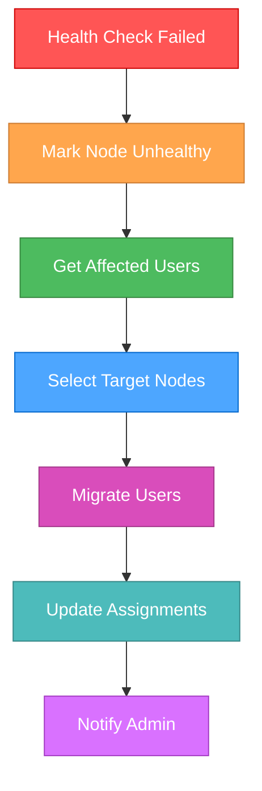

# 🎨🎨🎨 ENTERING CREATIVE PHASE: MULTI-NODE VPN ARCHITECTURE 🎨🎨🎨

**Creative Phase Type**: Architecture Design  
**Date**: 2025-01-09  
**Task**: Multi-Node VPN System Architecture  
**Complexity**: Level 2 (Simple Enhancement)  

## 📋 COMPONENT DESCRIPTION

Проектирование архитектуры для системы множественных VPN нод, которая позволит:
- Управлять несколькими X3UI серверами из единой админки
- Автоматически распределять пользователей между серверами
- Обеспечивать failover при отказе серверов
- Масштабировать систему добавлением новых нод

## 🎯 REQUIREMENTS & CONSTRAINTS

### Core Requirements:
- **Multi-server support**: Поддержка множественных X3UI панелей на разных серверах
- **Automatic load balancing**: Автоматическое распределение пользователей при создании ключей
- **Node management**: CRUD операции для серверных нод через админку
- **Health monitoring**: Мониторинг доступности и нагрузки каждой ноды
- **Failover capability**: Переключение на резервные серверы при отказах
- **Seamless integration**: Совместимость с существующим VPN Manager

### Technical Constraints:
- **Existing PostgreSQL**: Использование текущей PostgreSQL базы
- **Current X3UI client**: Расширение существующего X3UI клиента
- **Admin panel integration**: Интеграция с текущей админкой
- **Bot compatibility**: Сохранение работы бота без изменений для пользователей
- **Single control point**: Управление всеми нодами из одной точки

### Infrastructure Constraints:
- **Current setup**: 1 действующий сервер с X3UI
- **Future expansion**: Возможность добавления новых серверов
- **Network latency**: Учет задержек между серверами
- **Independent X3UI**: Каждый сервер имеет свою X3UI панель

## 🏗️ ARCHITECTURE OPTIONS ANALYSIS

### Option 1: Centralized Controller Architecture

**Description**: Централизованная система с единым контроллером, управляющим всеми нодами

**Architecture Overview**:
```
┌─────────────────────────────────────────────────┐
│                 CENTRAL SYSTEM                  │
├─────────────────────────────────────────────────┤
│  ┌─────────────┐  ┌──────────────┐  ┌─────────┐ │
│  │   Admin     │  │ Node Manager │  │ Load    │ │
│  │   Panel     │  │   Service    │  │Balancer │ │
│  └─────────────┘  └──────────────┘  └─────────┘ │
│              │           │              │       │
│  ┌─────────────────────────────────────────────┐ │
│  │          PostgreSQL Database              │ │
│  │  ┌─────────────┐  ┌─────────────────────┐  │ │
│  │  │ vpn_nodes   │  │ user_node_assignments│  │ │
│  │  └─────────────┘  └─────────────────────┘  │ │
│  └─────────────────────────────────────────────┘ │
└─────────────────────────────────────────────────┘
               │         │         │
         ┌─────┴───┐ ┌───┴───┐ ┌───┴─────┐
         │ Node 1  │ │Node 2 │ │ Node N  │
         │(X3UI-1) │ │(X3UI-2)│ │(X3UI-N) │
         └─────────┘ └───────┘ └─────────┘
```

**Components**:
- **NodeManager**: Централизованное управление всеми нодами
- **LoadBalancer**: Алгоритмы распределения пользователей
- **HealthChecker**: Мониторинг состояния всех нод
- **X3UIClientPool**: Пул соединений к различным X3UI панелям

**Pros**:
- Простота управления и мониторинга
- Единая точка конфигурации
- Легкое масштабирование
- Централизованное логирование и аудит

**Cons**:
- Единая точка отказа (SPOF)
- Возможные проблемы с сетевой задержкой
- Сложность обеспечения высокой доступности

**Technical Fit**: High  
**Complexity**: Medium  
**Scalability**: High  

### Option 2: Federated Architecture

**Description**: Федеративная система где каждая нода имеет локальную автономию

**Architecture Overview**:
```
┌─────────────────────────────────────────────────┐
│              COORDINATION LAYER                 │
├─────────────────────────────────────────────────┤
│  ┌─────────────┐  ┌──────────────┐             │
│  │   Global    │  │  Federation  │             │
│  │   Admin     │  │  Controller  │             │
│  └─────────────┘  └──────────────┘             │
│              │           │                      │
│  ┌─────────────────────────────────────────────┐ │
│  │      Shared PostgreSQL Database           │ │
│  └─────────────────────────────────────────────┘ │
└─────────────────────────────────────────────────┘
               │         │         │
    ┌──────────┴───┐ ┌───┴───┐ ┌───┴─────────┐
    │   Node 1     │ │Node 2 │ │   Node N    │
    │ ┌─────────┐  │ │       │ │             │
    │ │Local    │  │ │       │ │             │
    │ │Manager  │  │ │       │ │             │
    │ └─────────┘  │ │       │ │             │
    │   X3UI-1     │ │X3UI-2 │ │   X3UI-N    │
    └──────────────┘ └───────┘ └─────────────┘
```

**Pros**:
- Высокая отказоустойчивость
- Локальная автономия нод
- Лучшая производительность для локальных операций

**Cons**:
- Сложность синхронизации
- Усложненное управление
- Потенциальные конфликты данных

**Technical Fit**: Medium  
**Complexity**: High  
**Scalability**: High  

### Option 3: Hybrid Architecture

**Description**: Гибридный подход с централизованным управлением и распределенным исполнением

**Architecture Overview**:
```
┌─────────────────────────────────────────────────┐
│               CONTROL PLANE                     │
├─────────────────────────────────────────────────┤
│  ┌─────────────┐  ┌──────────────┐  ┌─────────┐ │
│  │   Admin     │  │ Orchestrator │  │Registry │ │
│  │   Panel     │  │   Service    │  │Service  │ │
│  └─────────────┘  └──────────────┘  └─────────┘ │
│  ┌─────────────────────────────────────────────┐ │
│  │          PostgreSQL Database              │ │
│  └─────────────────────────────────────────────┘ │
└─────────────────────────────────────────────────┘
               │         │         │
         ┌─────┴───┐ ┌───┴───┐ ┌───┴─────┐
         │ Node 1  │ │Node 2 │ │ Node N  │
         │Agent+   │ │Agent+ │ │ Agent+  │
         │X3UI     │ │X3UI   │ │ X3UI    │
         └─────────┘ └───────┘ └─────────┘
              │         │         │
      ┌───────┴───┐ ┌───┴───┐ ┌───┴─────┐
      │Health     │ │Health │ │ Health  │
      │Reporter   │ │Report.│ │Reporter │
      └───────────┘ └───────┘ └─────────┘
```

**Pros**:
- Баланс между централизацией и автономией
- Хорошая отказоустойчивость
- Гибкость в управлении

**Cons**:
- Средняя сложность реализации
- Требует дополнительных компонентов

**Technical Fit**: High  
**Complexity**: Medium  
**Scalability**: High  

## 🎯 RECOMMENDED APPROACH: Centralized Controller Architecture

**Rationale**: Option 1 (Centralized Controller) выбран как оптимальный для данного проекта по следующим причинам:

1. **Простота реализации**: Наименьшие изменения в существующей архитектуре
2. **Быстрота разработки**: Можно реализовать за 4 недели
3. **Интеграция**: Легко интегрируется с существующей админкой
4. **Управляемость**: Единая точка управления всеми нодами
5. **Масштабируемость**: При необходимости можно мигрировать к Hybrid

## 🏗️ DETAILED ARCHITECTURE DESIGN

### Database Schema Extensions

```sql
-- Таблица серверных нод
CREATE TABLE vpn_nodes (
    id SERIAL PRIMARY KEY,
    name VARCHAR(255) NOT NULL UNIQUE,
    description TEXT,
    location VARCHAR(100),
    
    -- X3UI connection settings
    x3ui_url VARCHAR(255) NOT NULL,
    x3ui_username VARCHAR(100) NOT NULL,
    x3ui_password VARCHAR(255) NOT NULL,
    
    -- Node capacity and status
    max_users INTEGER DEFAULT 1000,
    current_users INTEGER DEFAULT 0,
    status VARCHAR(50) DEFAULT 'active', -- active, inactive, maintenance
    
    -- Health monitoring
    last_health_check TIMESTAMP,
    health_status VARCHAR(50) DEFAULT 'unknown', -- healthy, unhealthy, unknown
    response_time_ms INTEGER,
    
    -- Configuration
    priority INTEGER DEFAULT 100, -- Higher = preferred
    weight FLOAT DEFAULT 1.0, -- Load balancing weight
    
    created_at TIMESTAMP DEFAULT NOW(),
    updated_at TIMESTAMP DEFAULT NOW()
);

-- Привязка пользователей к нодам
CREATE TABLE user_node_assignments (
    id SERIAL PRIMARY KEY,
    user_id INTEGER REFERENCES users(id) ON DELETE CASCADE,
    node_id INTEGER REFERENCES vpn_nodes(id) ON DELETE CASCADE,
    
    -- Assignment details
    assigned_at TIMESTAMP DEFAULT NOW(),
    is_active BOOLEAN DEFAULT TRUE,
    
    -- X3UI specific details
    xui_inbound_id INTEGER,
    xui_client_email VARCHAR(255),
    
    -- Constraints
    UNIQUE(user_id, node_id, is_active)
);

-- Индексы для производительности
CREATE INDEX idx_vpn_nodes_status ON vpn_nodes(status, health_status);
CREATE INDEX idx_vpn_nodes_priority ON vpn_nodes(priority DESC, weight DESC);
CREATE INDEX idx_user_node_assignments_active ON user_node_assignments(user_id, is_active);
CREATE INDEX idx_user_node_assignments_node ON user_node_assignments(node_id, is_active);
```

### Core Components Design

#### 1. NodeManager Service

```python
class NodeManager:
    """Управление серверными нодами VPN"""
    
    async def create_node(self, node_config: NodeConfig) -> VPNNode:
        """Создание новой ноды"""
        
    async def update_node(self, node_id: int, updates: dict) -> VPNNode:
        """Обновление конфигурации ноды"""
        
    async def delete_node(self, node_id: int) -> bool:
        """Удаление ноды (с миграцией пользователей)"""
        
    async def get_nodes(self, status: str = None) -> List[VPNNode]:
        """Получение списка нод"""
        
    async def test_node_connection(self, node_id: int) -> bool:
        """Тестирование подключения к ноде"""
```

#### 2. LoadBalancer Service

```python
class LoadBalancer:
    """Балансировка нагрузки между нодами"""
    
    async def select_optimal_node(self, user_id: int) -> VPNNode:
        """Выбор оптимальной ноды для пользователя"""
        
    async def rebalance_users(self) -> dict:
        """Перебалансировка пользователей между нодами"""
        
    async def migrate_user(self, user_id: int, target_node_id: int) -> bool:
        """Миграция пользователя на другую ноду"""
```

#### 3. HealthChecker Service

```python
class HealthChecker:
    """Мониторинг здоровья серверных нод"""
    
    async def check_node_health(self, node_id: int) -> HealthStatus:
        """Проверка состояния конкретной ноды"""
        
    async def check_all_nodes(self) -> Dict[int, HealthStatus]:
        """Проверка всех нод"""
        
    async def handle_unhealthy_node(self, node_id: int) -> None:
        """Обработка недоступной ноды"""
```

#### 4. Enhanced VPNManager

```python
class MultiNodeVPNManager(VPNManager):
    """Расширенный VPN менеджер для работы с множественными нодами"""
    
    async def get_or_create_user_key(self, telegram_id: int, username: str = "") -> Dict:
        """Создание ключа с автоматическим выбором ноды"""
        
    async def refresh_user_key(self, telegram_id: int, username: str = "") -> Dict:
        """Обновление ключа с возможной сменой ноды"""
        
    async def get_user_node_info(self, telegram_id: int) -> Dict:
        """Получение информации о ноде пользователя"""
```

### Load Balancing Algorithm

#### Weighted Round Robin with Health Checks

```python
async def select_optimal_node(self, user_id: int) -> VPNNode:
    """
    Алгоритм выбора оптимальной ноды:
    1. Фильтрация только здоровых нод
    2. Расчет нагрузки (current_users / max_users)
    3. Применение весов и приоритетов
    4. Выбор ноды с наименьшей взвешенной нагрузкой
    """
    
    # Получаем только активные и здоровые ноды
    healthy_nodes = await self.get_healthy_nodes()
    
    if not healthy_nodes:
        raise NoHealthyNodesException()
    
    # Рассчитываем оценку для каждой ноды
    scored_nodes = []
    for node in healthy_nodes:
        load_ratio = node.current_users / node.max_users
        priority_score = node.priority / 100.0
        weight_score = node.weight
        
        # Финальная оценка (меньше = лучше)
        final_score = load_ratio / (priority_score * weight_score)
        scored_nodes.append((node, final_score))
    
    # Выбираем ноду с наименьшей оценкой
    optimal_node = min(scored_nodes, key=lambda x: x[1])[0]
    return optimal_node
```

### Failover Strategy

#### Automatic Failover Process



### Admin Interface Extensions

#### New Admin Sections

1. **Node Management Dashboard**
   - List of all nodes with status
   - Add/Edit/Delete node operations
   - Node health monitoring
   - Load distribution visualization

2. **User Assignment View**
   - User to node mapping
   - Migration operations
   - Load balancing controls

3. **System Health Dashboard**
   - Overall system status
   - Performance metrics
   - Alert management

## 🔄 INTEGRATION STRATEGY

### Phase 1: Database Schema Migration

```python
# Migration script
class AddMultiNodeSupport:
    def up(self):
        # Create vpn_nodes table
        # Create user_node_assignments table
        # Migrate existing users to default node
        # Add indexes
        
    def down(self):
        # Rollback migration
```

### Phase 2: Service Layer Integration

```python
# Extended X3UI Client Pool
class X3UIClientPool:
    def __init__(self):
        self.clients = {}  # node_id -> X3UIClient
        
    async def get_client(self, node_id: int) -> X3UIClient:
        """Get X3UI client for specific node"""
        
    async def refresh_client(self, node_id: int) -> None:
        """Refresh connection for node"""
```

### Phase 3: Admin Interface Integration

- Extend existing admin routes
- Add new templates for node management
- Update user view to show node assignment
- Add monitoring dashboards

## ✅ VALIDATION & VERIFICATION

### Requirements Verification

- ✅ **Multi-server support**: Architecture supports multiple X3UI servers
- ✅ **Automatic load balancing**: LoadBalancer provides optimal node selection
- ✅ **Node management**: NodeManager provides full CRUD operations
- ✅ **Health monitoring**: HealthChecker monitors all nodes continuously
- ✅ **Failover capability**: Automatic failover with user migration
- ✅ **Seamless integration**: Extends existing VPNManager without breaking changes

### Technical Feasibility

- ✅ **Database**: PostgreSQL extensions are straightforward
- ✅ **Code changes**: Minimal changes to existing codebase
- ✅ **Performance**: Distributed load should improve performance
- ✅ **Scalability**: Can easily add new nodes
- ✅ **Maintenance**: Centralized management simplifies operations

### Risk Assessment

- 🟡 **Network latency**: Manageable with proper timeout configurations
- 🟡 **Single point of failure**: Mitigated by robust error handling
- 🟢 **Data consistency**: PostgreSQL ACID properties ensure consistency
- 🟢 **Security**: Existing security model applies to all nodes

## 🚀 IMPLEMENTATION GUIDELINES

### Development Priorities

1. **Core Infrastructure**: Database schema + NodeManager
2. **Load Balancing**: LoadBalancer + HealthChecker services
3. **Integration**: VPNManager extension + X3UI client pool
4. **Admin Interface**: UI for node management
5. **Testing**: Comprehensive testing with multiple nodes

### Configuration Management

```yaml
# Node configuration example
nodes:
  - name: "Primary-RU"
    location: "Russia"
    x3ui_url: "https://vpn1.example.com:2053"
    priority: 100
    weight: 1.0
    max_users: 1000
    
  - name: "Secondary-EU"
    location: "Europe"
    x3ui_url: "https://vpn2.example.com:2053"
    priority: 90
    weight: 0.8
    max_users: 800
```

### Monitoring & Alerting

- Health check every 30 seconds
- Alert on node failure
- Performance metrics collection
- Load distribution monitoring

## 🎨🎨🎨 EXITING CREATIVE PHASE: ARCHITECTURE DESIGN COMPLETE 🎨🎨🎨

**Architecture Decision**: Centralized Controller Architecture with Weighted Load Balancing  
**Next Phase**: Implementation (BUILD MODE)  
**Implementation Ready**: ✅ All components defined and integration strategy documented 