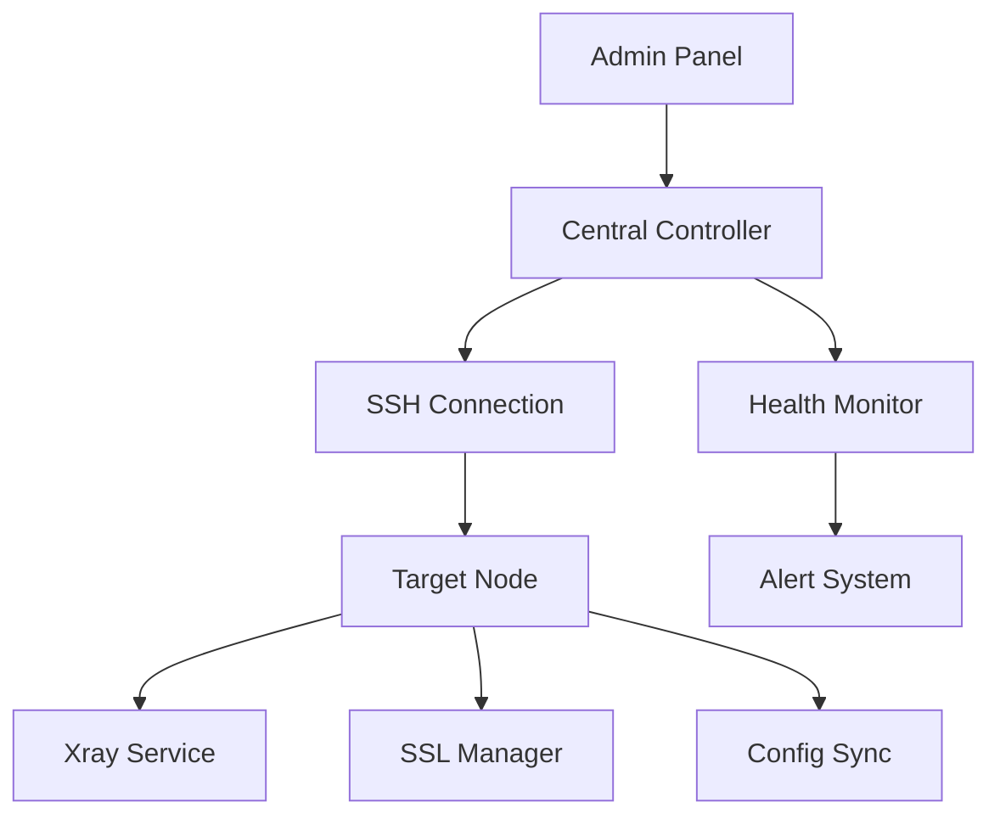
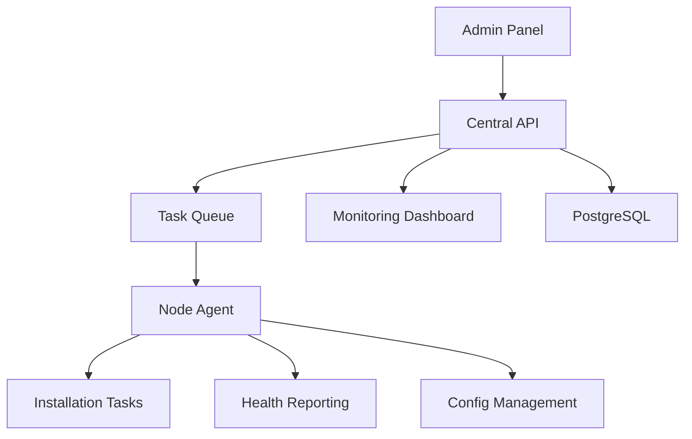
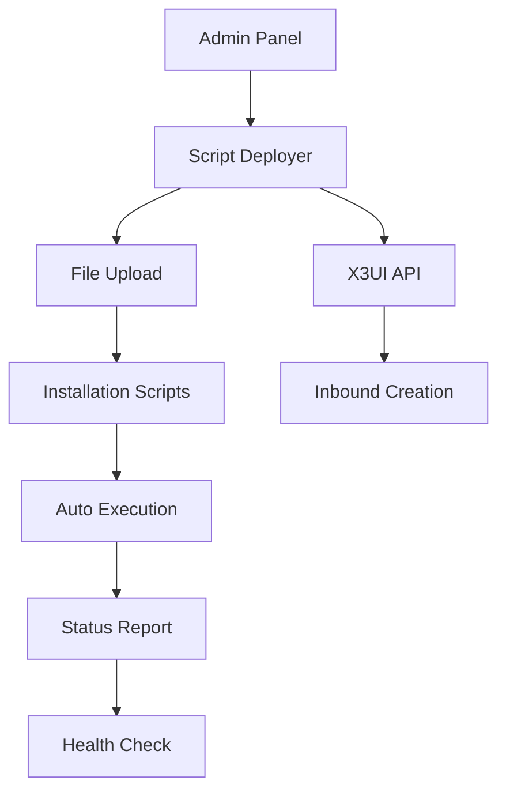
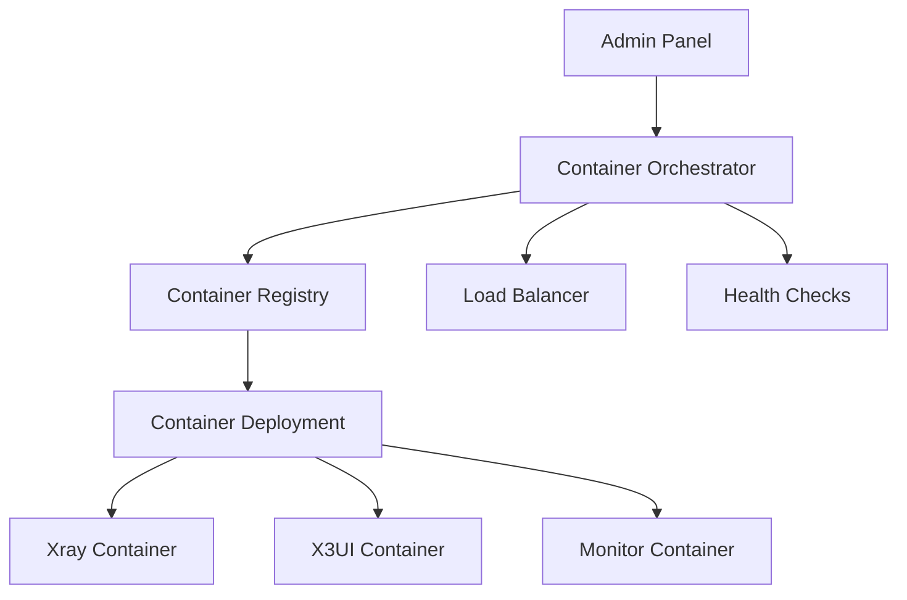
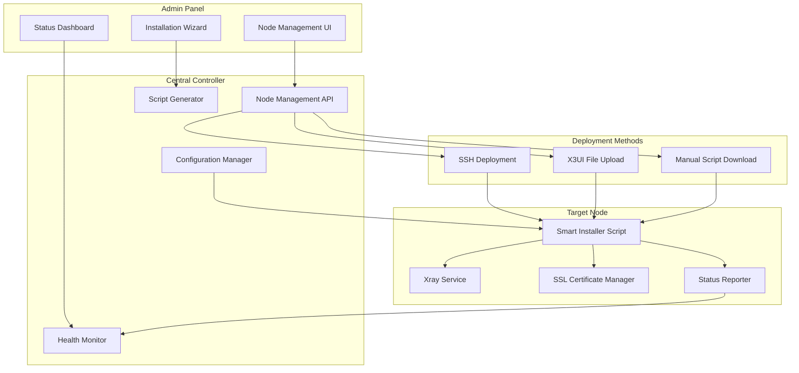

# 🎨🎨🎨 ENTERING CREATIVE PHASE: ARCHITECTURE DESIGN

## Component: VPN Node Automation System Architecture

### 🎯 Problem Definition

Необходимо спроектировать архитектуру системы, которая позволит добавлять новые VPN ноды через админку с минимальным ручным вмешательством. Текущая ситуация: получаем голый сервер с X3UI панелью, но без работающего xray и VPN функциональности.

### 📋 Requirements & Constraints

#### Functional Requirements:
- Добавление ноды через web админку одним действием
- Автоматическая установка и настройка xray
- Создание базовых inbound конфигураций
- SSL сертификаты и их автообновление
- Интеграция с центральной системой управления
- Health monitoring и auto-recovery

#### Technical Constraints:
- Различные варианты доступа: X3UI панель, SSH root, file upload
- Разные операционные системы нод (Ubuntu/CentOS)
- Сетевые ограничения и firewalls
- Домены и DNS настройки
- Существующая инфраструктура (PostgreSQL, load balancer)

#### Non-Functional Requirements:
- Время установки < 10 минут
- Успешность > 95%
- Минимальное ручное вмешательство
- Rollback при ошибках

### 🔄 Architecture Options Analysis

#### Option 1: SSH-Based Centralized Control


**Pros:**
- Полный контроль над установкой
- Единая точка управления
- Возможность сложных операций
- Детальное логирование

**Cons:**
- Требует SSH доступ с admin панели
- Проблемы с firewalls и сетевой безопасностью
- Сложность в debugging удаленных операций
- Зависимость от SSH доступности

#### Option 2: Agent-Based Distributed System


**Pros:**
- Автономная работа агентов
- Лучшая отказоустойчивость
- Масштабируемость
- Независимость от сетевых проблем

**Cons:**
- Сложность развертывания агентов
- Необходимость secure communication
- Версионирование агентов
- Больше компонентов для поддержки

#### Option 3: Hybrid X3UI API + Script Deployment


**Pros:**
- Использует существующую X3UI инфраструктуру
- Простота развертывания
- Меньше сетевых зависимостей
- Быстрая разработка

**Cons:**
- Зависимость от X3UI API стабильности
- Ограниченные возможности отладки
- Проблемы с правами доступа
- Менее гибкая система мониторинга

#### Option 4: Container-Based Orchestration


**Pros:**
- Изолированность компонентов
- Простота версионирования
- Консистентность окружения
- Автоматическое scaling

**Cons:**
- Требует container runtime на всех нодах
- Сложность initial setup
- Ресурсы на контейнеризацию
- Learning curve для команды

### 🎯 Recommended Approach: Hybrid X3UI + Smart Script System

**Выбираю Option 3 с улучшениями** по следующим причинам:

#### Architecture Decision Rationale:
1. **Минимальная инфраструктурная нагрузка** - используем существующую X3UI
2. **Быстрая разработка и deployment** - фокус на script automation
3. **Гибкость доступа** - поддержка multiple access methods
4. **Инкрементальное улучшение** - можно постепенно добавлять features

#### Enhanced Hybrid Architecture:



### 🔧 Implementation Guidelines

#### Core Components:

**1. Node Management API (FastAPI)**
```python
# Pseudo-code structure
class NodeManager:
    def create_node(self, node_config):
        # Generate installation script
        # Choose deployment method
        # Execute installation
        # Monitor progress
        
    def deploy_via_ssh(self, host, script):
        # SSH connection + script execution
        
    def deploy_via_x3ui(self, x3ui_url, script):
        # Upload script via X3UI file manager
        # Trigger execution via X3UI
        
    def monitor_installation(self, node_id):
        # Track installation progress
        # Health checks
```

**2. Smart Installer Script (Bash/Python)**
```bash
#!/bin/bash
# auto-node-installer.sh
# Self-contained installation script

# Phase 1: Environment Detection
detect_os_and_arch()
install_dependencies()
check_network_connectivity()

# Phase 2: Xray Installation  
download_and_install_xray()
configure_xray_service()
setup_systemd_service()

# Phase 3: SSL Management
install_certbot()
obtain_ssl_certificate()
setup_auto_renewal()

# Phase 4: Inbound Configuration
create_base_inbound_config()
apply_inbound_via_x3ui_api()

# Phase 5: Integration
register_with_central_system()
start_health_reporting()
```

**3. Configuration Template System**
```json
{
  "node_template": {
    "domain": "{{DOMAIN}}",
    "inbound_port": 443,
    "inbound_config": "{{INBOUND_9_TEMPLATE}}",
    "ssl_email": "{{ADMIN_EMAIL}}",
    "monitoring_endpoint": "{{CENTRAL_API}}/health"
  }
}
```

#### Deployment Flow:

**Step 1: Admin Input**
- Domain name for the node
- Access method (SSH credentials OR X3UI panel URL)
- Optional: custom configuration overrides

**Step 2: Script Generation**
- Generate personalized installation script
- Inject node-specific configuration
- Include health reporting endpoints

**Step 3: Deployment Method Selection**
- **SSH**: Direct script execution via SSH
- **X3UI Upload**: Upload script to X3UI panel, execute via web interface
- **Manual**: Provide download link for manual execution

**Step 4: Installation Process**
- Automated xray installation and configuration
- SSL certificate acquisition
- Inbound creation using inbound_9_template
- System integration and health reporting setup

**Step 5: Validation & Monitoring**
- Automated connectivity tests
- Integration with monitoring dashboard
- Success/failure reporting

#### Failure Handling Strategy:

**Rollback Mechanism:**
```bash
# Built into installer script
rollback_installation() {
    stop_services()
    remove_configurations()
    cleanup_certificates()
    report_failure_with_logs()
}
```

**Error Recovery:**
- Automatic retry for transient failures
- Detailed error logging and reporting
- Manual intervention points for complex issues
- Partial installation recovery

### ✅ Verification Against Requirements

**Functional Requirements:**
✅ One-click node addition via admin panel  
✅ Automatic xray installation and configuration  
✅ SSL certificate management  
✅ Integration with central system  
✅ Health monitoring

**Technical Constraints:**
✅ Supports multiple access methods (SSH, X3UI, manual)  
✅ OS detection and adaptation  
✅ Network and firewall handling  
✅ Integration with existing PostgreSQL/load balancer

**Non-Functional Requirements:**
✅ Target installation time < 10 minutes  
✅ High success rate through robust error handling  
✅ Minimal manual intervention via automation  
✅ Rollback capabilities for failed installations

### 🎨🎨🎨 EXITING CREATIVE PHASE: ARCHITECTURE

**Architecture Decision:** Hybrid X3UI + Smart Script System  
**Key Innovation:** Multi-method deployment with self-contained installer  
**Implementation Readiness:** High - builds on existing infrastructure  
**Risk Level:** Low-Medium - leverages proven patterns 