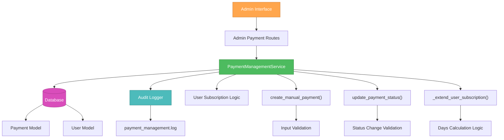

# 🎨🎨🎨 ENTERING CREATIVE PHASE: PAYMENT MANAGEMENT ARCHITECTURE 🎨🎨🎨

**Component:** Payment Management Service Architecture  
**Priority:** HIGH  
**Date:** 2025-01-08  
**Task:** Manual Payment Management System

## 🎯 PROBLEM STATEMENT

Необходимо спроектировать архитектуру для безопасного ручного управления платежами в админ-панели с требованиями:

- Создание платежей вручную (включая триальные за 0₽)
- Изменение статуса платежей с автоматическим продлением подписки
- Audit logging всех операций с платежами
- Интеграция с существующей системой платежей
- Безопасность и защита от race conditions
- Rollback capability при ошибках

## 🔍 COMPONENT ANALYSIS

### Core Components Required:
- **PaymentManagementService** - основная бизнес-логика
- **Payment Status Handler** - обработка смены статусов
- **Subscription Extension Service** - логика продления подписок  
- **Audit Logger** - логирование всех операций
- **Admin Authentication Integration** - проверка прав доступа

### Existing Integration Points:
- `models/payment.py` - Payment model с PaymentStatus enum
- `models/user.py` - User model с subscription logic
- `app/admin/auth.py` - админ аутентификация
- `services/payment_processor.py` - существующие payment services

## 🏗️ ARCHITECTURE OPTIONS

### Option 1: Service Layer Pattern with Transaction Management

**Description:** Создать централизованный PaymentManagementService с транзакционными методами

```python
class PaymentManagementService:
    def __init__(self, db_session, audit_logger):
        self.db = db_session
        self.audit = audit_logger
    
    async def create_manual_payment(
        self, user_id: int, amount: float, 
        description: str, payment_method: str,
        admin_user: str
    ) -> Payment:
        async with self.db.begin():
            # Create payment
            # Log audit event
            # Return payment
    
    async def update_payment_status(
        self, payment_id: int, new_status: PaymentStatus,
        admin_user: str
    ) -> Payment:
        async with self.db.begin():
            # Update payment status
            # If SUCCEEDED -> extend subscription
            # Log audit event
            # Return updated payment
    
    async def extend_user_subscription(
        self, user_id: int, payment_id: int, days: int
    ) -> User:
        # Update user.valid_until
        # Set subscription_status = 'active'
        # Log subscription change
```

**Pros:**
- ✅ Централизованная бизнес-логика
- ✅ Транзакционная безопасность
- ✅ Простота тестирования
- ✅ Четкое разделение ответственности
- ✅ Легко добавить caching и validation

**Cons:**
- ❌ Может стать монолитным при росте функционала
- ❌ Все операции в одном классе
- ❌ Сложность при parallel processing

**Complexity:** Medium  
**Implementation Time:** 2-3 дня  
**Security Level:** High  
**Scalability:** Medium

---

### Option 2: Command Pattern with CQRS

**Description:** Использовать Command Pattern для операций записи и Query handlers для чтения

```python
# Commands
class CreatePaymentCommand:
    user_id: int
    amount: float
    description: str
    payment_method: str
    admin_user: str

class UpdatePaymentStatusCommand:
    payment_id: int
    new_status: PaymentStatus
    admin_user: str

# Handlers
class CreatePaymentHandler:
    async def handle(self, command: CreatePaymentCommand) -> Payment:
        # Validation
        # Business logic
        # Database operations
        # Event publishing

class UpdatePaymentStatusHandler:
    async def handle(self, command: UpdatePaymentStatusCommand) -> Payment:
        # Validation
        # Status change logic
        # Subscription extension
        # Event publishing

# Query handlers
class PaymentQueryHandler:
    async def get_user_payments(self, user_id: int) -> List[Payment]:
        # Read operations
```

**Pros:**
- ✅ Отличное разделение команд и запросов
- ✅ Легко добавлять новые операции
- ✅ Event-driven architecture готовность
- ✅ Простота unit testing отдельных handlers
- ✅ Scalability для сложных бизнес-процессов

**Cons:**
- ❌ Overkill для текущих требований
- ❌ Высокая сложность implementation
- ❌ Много boilerplate кода
- ❌ Требует больше времени на разработку

**Complexity:** High  
**Implementation Time:** 4-5 дней  
**Security Level:** High  
**Scalability:** Very High

---

### Option 3: Repository Pattern with Domain Services

**Description:** Создать Repository слой и отдельные Domain Services для различных операций

```python
class PaymentRepository:
    async def create_payment(self, payment_data: dict) -> Payment:
        # Database creation logic
    
    async def update_payment_status(self, payment_id: int, status: PaymentStatus) -> Payment:
        # Database update logic
    
    async def get_user_payments(self, user_id: int) -> List[Payment]:
        # Query logic

class PaymentDomainService:
    def __init__(self, payment_repo, user_repo, audit_service):
        self.payment_repo = payment_repo
        self.user_repo = user_repo
        self.audit_service = audit_service
    
    async def create_manual_payment(self, ...):
        # Business logic + Repository calls
    
    async def process_payment_status_change(self, ...):
        # Business logic + Repository calls

class SubscriptionExtensionService:
    async def extend_subscription(self, user_id: int, days: int):
        # Subscription logic
```

**Pros:**
- ✅ Четкое разделение data access и business logic
- ✅ Легко mockать для тестирования
- ✅ Reusable repository слой
- ✅ Хорошая организация кода
- ✅ Соответствует DDD принципам

**Cons:**
- ❌ Больше абстракций чем нужно
- ❌ Дополнительная сложность
- ❌ Может быть избыточным для небольшого функционала
- ❌ Требует больше времени на setup

**Complexity:** Medium-High  
**Implementation Time:** 3-4 дня  
**Security Level:** High  
**Scalability:** High

---

### Option 4: Lightweight Service with Mixin Pattern

**Description:** Простой сервис класс с mixin-ами для разных функций

```python
class AuditMixin:
    async def log_payment_operation(self, operation: str, payment_id: int, admin_user: str):
        # Audit logging logic

class SubscriptionMixin:
    async def extend_user_subscription_by_payment(self, payment: Payment):
        # Determine days from payment/plan
        # Extend subscription
        # Update user status

class PaymentManagementService(AuditMixin, SubscriptionMixin):
    def __init__(self, db_session):
        self.db = db_session
    
    async def create_manual_payment(self, user_id, amount, description, payment_method, admin_user):
        async with self.db.begin():
            payment = Payment(...)
            self.db.add(payment)
            await self.log_payment_operation("CREATE", payment.id, admin_user)
            return payment
    
    async def update_payment_status(self, payment_id, new_status, admin_user):
        async with self.db.begin():
            payment = await self.db.get(Payment, payment_id)
            old_status = payment.status
            payment.status = new_status
            
            if new_status == PaymentStatus.SUCCEEDED and old_status != PaymentStatus.SUCCEEDED:
                await self.extend_user_subscription_by_payment(payment)
            
            await self.log_payment_operation("STATUS_CHANGE", payment_id, admin_user)
            return payment
```

**Pros:**
- ✅ Простота implementation и понимания
- ✅ Быстрая разработка
- ✅ Легко добавлять новые mixin-ы
- ✅ Хорошая testability
- ✅ Минимум boilerplate кода

**Cons:**
- ❌ Может стать сложным при росте функционала
- ❌ Mixin dependencies могут быть неочевидными
- ❌ Менее formal architecture
- ❌ Сложность при нескольких inheritance levels

**Complexity:** Low-Medium  
**Implementation Time:** 1-2 дня  
**Security Level:** Medium-High  
**Scalability:** Medium

## 🎨 CREATIVE CHECKPOINT: OPTIONS EVALUATION

### Evaluation Criteria Scoring (1-5):

| Criteria | Option 1: Service Layer | Option 2: Command Pattern | Option 3: Repository | Option 4: Mixin |
|----------|-------------------------|----------------------------|----------------------|-------------------|
| **Simplicity** | 4 | 2 | 3 | 5 |
| **Security** | 5 | 5 | 5 | 4 |
| **Maintainability** | 4 | 5 | 4 | 3 |
| **Testability** | 4 | 5 | 5 | 4 |
| **Time to Market** | 4 | 2 | 3 | 5 |
| **Scalability** | 3 | 5 | 4 | 3 |
| **Integration Fit** | 5 | 3 | 4 | 5 |
| **Code Readability** | 4 | 3 | 4 | 5 |

### **Total Scores:**
- Option 1 (Service Layer): **32/40**
- Option 2 (Command Pattern): **30/40** 
- Option 3 (Repository): **32/40**
- Option 4 (Mixin): **34/40**

## 🎯 DECISION

**Selected Option:** **Option 1: Service Layer Pattern with Transaction Management**

### Rationale:

1. **Optimal Balance:** Предоставляет хороший баланс между простотой и architecture quality
2. **Security First:** Транзакционная безопасность критична для financial operations
3. **Integration Friendly:** Хорошо интегрируется с существующей FastAPI + SQLAlchemy архитектурой
4. **Business Logic Clarity:** Централизованная логика упрощает maintenance и debugging
5. **Audit Requirements:** Естественно поддерживает audit logging требования
6. **Performance:** Эффективная работа с database через async sessions

**Why not other options:**
- Option 2: Слишком сложен для current scope, overkill
- Option 3: Добавляет complexity без sufficient benefits 
- Option 4: Хотя и быстр в реализации, но менее robust для financial operations

## 📋 IMPLEMENTATION PLAN

### Phase 1: Core Service Infrastructure
```python
# services/payment_management_service.py
class PaymentManagementService:
    def __init__(self, db_session: AsyncSession):
        self.db = db_session
        self.audit_logger = structlog.get_logger("payment_management")

    async def create_manual_payment(
        self, user_id: int, amount: float, description: str, 
        payment_method: PaymentMethod, admin_user: str
    ) -> Payment:
        """Create manual payment with audit logging"""
        pass
    
    async def update_payment_status(
        self, payment_id: int, new_status: PaymentStatus, 
        admin_user: str, reason: str = None
    ) -> Payment:
        """Update payment status with business logic"""
        pass
```

### Phase 2: Subscription Extension Logic
```python
    async def _extend_user_subscription(
        self, payment: Payment
    ) -> Optional[User]:
        """Extend user subscription based on payment"""
        # Determine days from payment amount/description
        # Update user.valid_until
        # Set subscription_status = 'active'
        pass
    
    def _calculate_subscription_days(
        self, payment: Payment
    ) -> int:
        """Calculate days to extend based on payment"""
        # Business logic for days calculation
        pass
```

### Phase 3: Audit and Security
```python
    async def _log_payment_operation(
        self, operation: str, payment_id: int, 
        admin_user: str, details: dict = None
    ):
        """Comprehensive audit logging"""
        pass
    
    async def _validate_payment_status_change(
        self, payment: Payment, new_status: PaymentStatus
    ) -> bool:
        """Validate status change is allowed"""
        pass
```

### Phase 4: Integration Points
- Admin routes integration
- Error handling and validation
- Transaction rollback scenarios
- Comprehensive testing

## 📊 ARCHITECTURE DIAGRAM



## ✅ VERIFICATION AGAINST REQUIREMENTS

- [x] **Manual Payment Creation**: ✅ create_manual_payment() method
- [x] **Status Management**: ✅ update_payment_status() with business logic
- [x] **Subscription Extension**: ✅ _extend_user_subscription() integration
- [x] **Audit Logging**: ✅ _log_payment_operation() for all operations
- [x] **Security**: ✅ Transaction management and validation
- [x] **Integration**: ✅ Compatible with existing Payment/User models
- [x] **Error Handling**: ✅ Rollback capability through transactions

## 🎨🎨🎨 EXITING CREATIVE PHASE - ARCHITECTURE DECISION MADE 🎨🎨🎨

**Decision:** Service Layer Pattern with PaymentManagementService  
**Next Phase:** UI/UX Design Patterns for Admin Interface  
**Implementation Ready:** ✅ Architecture designed and documented 