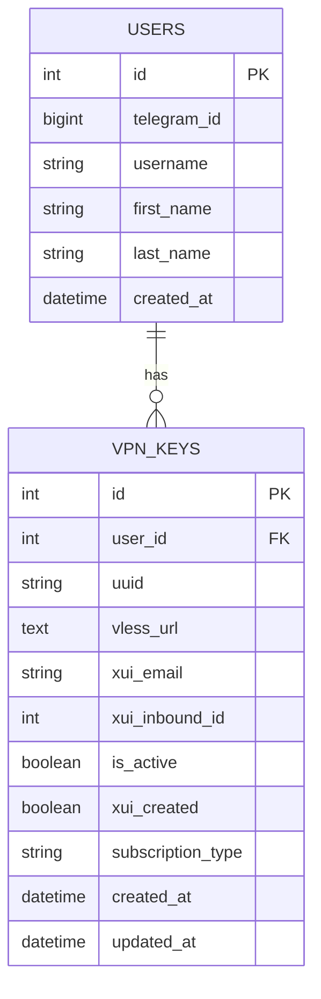

# Миграция на PostgreSQL - Документация дизайна

## 📊 Проектирование структуры базы данных

### 🎯 Цели миграции
- Обеспечение **масштабируемости** хранения данных
- Повышение **надежности** через транзакционную систему
- Установление **связей** между данными через реляционную модель
- Обеспечение **параллельного доступа** и многопоточной работы
- Добавление возможности выполнять **SQL запросы** для аналитики

### 📑 Выбор модели данных
После анализа текущего хранилища `vpn_keys.json` и существующего кода, определен следующий подход к моделированию:

#### Основные сущности:
1. **Пользователь** (User) - хранит информацию о пользователе Telegram
2. **VPN ключ** (VPNKey) - хранит информацию о созданных VPN ключах

#### Связи между сущностями:
- Один пользователь может иметь множество VPN ключей (one-to-many)
- Каждый ключ принадлежит только одному пользователю

## 🏗️ Схема базы данных

### 📋 Схема таблиц



### 🔗 Описание таблиц

#### 1. Таблица `users`
| Поле | Тип | Описание |
|------|-----|----------|
| `id` | SERIAL | Первичный ключ |
| `telegram_id` | BIGINT | Идентификатор пользователя в Telegram (уникальный) |
| `username` | VARCHAR(255) | Username пользователя в Telegram |
| `first_name` | VARCHAR(255) | Имя пользователя |
| `last_name` | VARCHAR(255) | Фамилия пользователя |
| `created_at` | TIMESTAMP | Время создания записи |

#### 2. Таблица `vpn_keys`
| Поле | Тип | Описание |
|------|-----|----------|
| `id` | SERIAL | Первичный ключ |
| `user_id` | INTEGER | Внешний ключ на таблицу users |
| `uuid` | VARCHAR(36) | UUID ключа VPN |
| `vless_url` | TEXT | Полный URL для подключения |
| `xui_email` | VARCHAR(255) | Email в системе x-ui |
| `xui_inbound_id` | INTEGER | ID входящего подключения в x-ui |
| `is_active` | BOOLEAN | Флаг активности ключа |
| `xui_created` | BOOLEAN | Флаг создания в x-ui |
| `subscription_type` | VARCHAR(50) | Тип подписки |
| `created_at` | TIMESTAMP | Время создания ключа |
| `updated_at` | TIMESTAMP | Время последнего обновления |

## 🧩 Интеграция с существующим кодом

### 📦 Выбор ORM: SQLAlchemy

Для работы с PostgreSQL выбран SQLAlchemy как наиболее мощный и гибкий ORM для Python:

#### Преимущества SQLAlchemy:
- Типизированная схема данных
- Поддержка миграций через Alembic
- Сессионная модель работы
- Транзакционность операций
- Возможность выполнения нативных SQL запросов

### 🔄 API совместимости с текущим кодом

Для обеспечения минимальных изменений в существующем коде создан класс `PostgresStorage` с тем же интерфейсом, что и `SimpleStorage`:

```python
class PostgresStorage:
    def get_user_vpn_keys(self, telegram_id: int) -> List[Dict[str, Any]]:
        # Возвращает все ключи пользователя в том же формате что и SimpleStorage
        pass
        
    def save_vpn_key(self, key_data: Dict[str, Any]) -> bool:
        # Сохраняет ключ в БД с тем же интерфейсом
        pass
        
    def update_vpn_key(self, key_id: int, update_data: Dict[str, Any]) -> bool:
        # Обновляет существующий ключ с тем же интерфейсом
        pass
```

## 🔄 Миграция данных

### 📤 Стратегия миграции

1. **Создание таблиц**: Автоматическое создание таблиц при первом запуске
2. **Миграция данных**: Специальный скрипт для переноса данных из JSON в PostgreSQL
3. **Верификация**: Сравнение количества записей до и после миграции
4. **Автоматический откат**: В случае ошибки возврат к JSON хранилищу

### 📃 SQL для создания схемы

```sql
-- Таблица пользователей
CREATE TABLE users (
    id SERIAL PRIMARY KEY,
    telegram_id BIGINT NOT NULL UNIQUE,
    username VARCHAR(255),
    first_name VARCHAR(255),
    last_name VARCHAR(255),
    created_at TIMESTAMP DEFAULT CURRENT_TIMESTAMP
);

-- Таблица VPN ключей
CREATE TABLE vpn_keys (
    id SERIAL PRIMARY KEY,
    user_id INTEGER REFERENCES users(id),
    uuid VARCHAR(36) NOT NULL,
    vless_url TEXT NOT NULL,
    xui_email VARCHAR(255) NOT NULL,
    xui_inbound_id INTEGER NOT NULL,
    is_active BOOLEAN DEFAULT TRUE,
    xui_created BOOLEAN DEFAULT TRUE,
    subscription_type VARCHAR(50) DEFAULT 'auto',
    created_at TIMESTAMP DEFAULT CURRENT_TIMESTAMP,
    updated_at TIMESTAMP DEFAULT CURRENT_TIMESTAMP
);

-- Индексы для ускорения работы
CREATE INDEX idx_vpn_keys_user_id ON vpn_keys(user_id);
CREATE INDEX idx_vpn_keys_is_active ON vpn_keys(is_active);
CREATE INDEX idx_users_telegram_id ON users(telegram_id);
```

## 🧪 Тестовые сценарии

### 1. Миграция данных
- **Цель**: Проверить корректность миграции данных из JSON в PostgreSQL
- **Тест**: Запустить скрипт миграции и сравнить количество записей

### 2. CRUD операции
- **Цель**: Проверить базовые операции создания/чтения/обновления/удаления
- **Тест**: Выполнить типичные операции через API хранилища

### 3. Производительность
- **Цель**: Сравнить производительность PostgreSQL с JSON хранилищем
- **Тест**: Замерить время типичных операций в обоих вариантах

### 4. Отказоустойчивость
- **Цель**: Проверить поведение при ошибках соединения с БД
- **Тест**: Симулировать падение БД и восстановление

## 🚀 Docker конфигурация

### 📦 Основная конфигурация

```yaml
services:
  bot:
    # ... существующая конфигурация бота
    depends_on:
      - db
    environment:
      - DATABASE_URL=postgresql://vpn_user:vpn_password@db:5432/vpn_db

  db:
    image: postgres:15-alpine
    volumes:
      - postgres_data:/var/lib/postgresql/data
    environment:
      - POSTGRES_PASSWORD=vpn_password
      - POSTGRES_USER=vpn_user
      - POSTGRES_DB=vpn_db
    restart: unless-stopped
    healthcheck:
      test: ["CMD-SHELL", "pg_isready -U vpn_user -d vpn_db"]
      interval: 10s
      timeout: 5s
      retries: 5

volumes:
  postgres_data:
```

## 📊 Ожидаемые результаты

### 📈 Улучшения после миграции
- **Масштабируемость**: Возможность хранить миллионы записей
- **Надежность**: Транзакционная система и инкрементальные бэкапы
- **Структурированность**: Отношения между сущностями через foreign keys
- **Производительность**: Высокая скорость операций благодаря индексированию
- **Аналитика**: Возможность выполнять SQL запросы для анализа данных
- **Параллельный доступ**: Множество потоков могут одновременно работать с БД

## 🎨 Дизайн-решения

### 1. Отделение моделей от логики работы с БД
Модели определены отдельно от классов, работающих с ними, что позволяет легко модифицировать схему.

### 2. Сохранение интерфейса совместимости
API хранилища сохраняет тот же интерфейс, что минимизирует изменения в остальном коде.

### 3. Connection pooling для оптимизации
Используется пул соединений для предотвращения частого открытия/закрытия соединений.

### 4. Автоматическое создание схемы
БД создается автоматически при первом запуске, что упрощает деплой.

### 5. Плавная миграция данных
Скрипт миграции переносит данные из JSON в PostgreSQL без потери информации. 