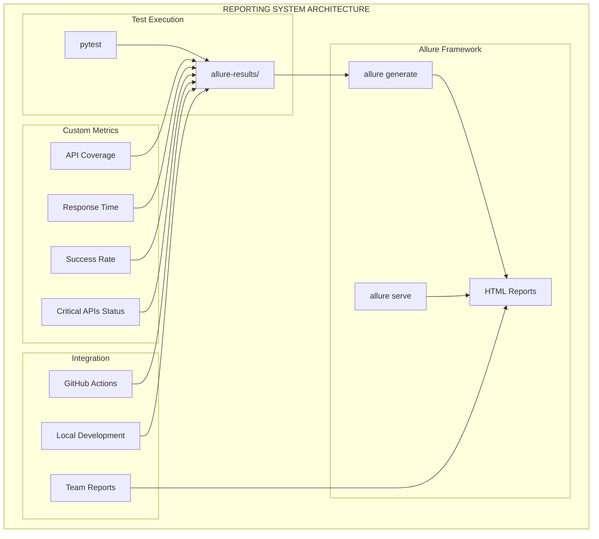

# 🎨🎨🎨 ENTERING CREATIVE PHASE: REPORTING SYSTEM 🎨🎨🎨

## 📊 ТВОРЧЕСКАЯ ФАЗА 3: СИСТЕМА ОТЧЕТНОСТИ И МОНИТОРИНГА

### 📋 ПРОБЛЕМА И ТРЕБОВАНИЯ

**Контекст:**
- Необходимо создать красивую и информативную систему отчетности
- Интеграция с Allure Framework для профессиональных отчетов
- Требуется быстрый старт с базовыми отчетами
- Возможность расширения для команды разработки

**Ключевые требования:**
1. **Красивые отчеты** - профессиональный внешний вид
2. **Информативность** - детальная информация о тестах
3. **Быстрый старт** - простые отчеты для первых тестов
4. **Масштабируемость** - легко добавлять новые метрики
5. **Интеграция** - работа с CI/CD и командой

### 🎯 АНАЛИЗ КОМПОНЕНТОВ ОТЧЕТНОСТИ

#### 1. Allure Framework (Основной инструмент)

**Характеристики:**
- **Тип**: Система отчетности для тестов
- **Возможности**: HTML отчеты, метрики, скриншоты, логи
- **Интеграция**: pytest, CI/CD
- **Сложность**: Низкая для базового использования

**Ключевые функции:**
- ✅ Красивые HTML отчеты
- ✅ Метрики и графики
- ✅ Прикрепление файлов и скриншотов
- ✅ Фильтрация и поиск
- ✅ История тестов

#### 2. Кастомные метрики

**Требуемые метрики:**
- **Покрытие API** - сколько эндпоинтов протестировано
- **Время выполнения** - скорость тестов
- **Стабильность** - процент успешных прогонов
- **Критичность** - приоритет тестируемых API

#### 3. Интеграция с CI/CD

**Варианты интеграции:**
- **GitHub Actions** - автоматические отчеты
- **Локальная разработка** - быстрые отчеты
- **Командная работа** - общие отчеты

### 🔄 ВАРИАНТЫ СИСТЕМЫ ОТЧЕТНОСТИ

#### Вариант 1: Минимальная настройка Allure (Рекомендуемый для быстрого старта)

**Описание:**
- Базовая настройка Allure
- Простые отчеты без кастомизации
- Фокус на быстром старте
- Стандартные метрики

**Конфигурация:**
```python
# pytest.ini
[tool:pytest]
addopts = --alluredir=./allure-results --clean-alluredir
testpaths = tests
python_files = test_*.py
python_classes = Test*
python_functions = test_*
asyncio_mode = auto
```

**Плюсы:**
- ✅ Очень быстрый старт (30 минут)
- ✅ Минимальная настройка
- ✅ Красивые отчеты из коробки
- ✅ Стандартные возможности

**Минусы:**
- ❌ Ограниченная кастомизация
- ❌ Базовые метрики
- ❌ Нет специфичных для проекта данных

**Время реализации:** 0.5 дня

#### Вариант 2: Расширенная настройка Allure

**Описание:**
- Кастомные метрики и дашборды
- Специфичные для проекта отчеты
- Интеграция с бизнес-логикой
- Расширенные возможности

**Дополнительные возможности:**
- Кастомные метрики покрытия API
- Бизнес-метрики (критичные API, время отклика)
- Интеграция с мониторингом
- Автоматические алерты

**Плюсы:**
- ✅ Максимальная информативность
- ✅ Специфичные для проекта данные
- ✅ Профессиональные отчеты
- ✅ Интеграция с мониторингом

**Минусы:**
- ❌ Больше времени на настройку
- ❌ Сложность конфигурации
- ❌ Больше кода для поддержки

**Время реализации:** 2-3 дня

#### Вариант 3: Гибридный подход

**Описание:**
- Начать с минимальной настройки
- Постепенно добавлять кастомные метрики
- Эволюционировать по мере роста проекта
- Адаптироваться к потребностям команды

**Этапы развития:**
1. **Этап 1**: Базовая настройка Allure (0.5 дня)
2. **Этап 2**: Добавление кастомных метрик (1 день)
3. **Этап 3**: Интеграция с CI/CD (0.5 дня)
4. **Этап 4**: Расширенные возможности (1 день)

**Плюсы:**
- ✅ Быстрый старт
- ✅ Гибкость развития
- ✅ Адаптивность к потребностям
- ✅ Постепенное улучшение

**Минусы:**
- ❌ Может потребовать рефакторинга
- ❌ Нужна дисциплина развития
- ❌ Риск остановиться на базовом уровне

**Время реализации:** 3 дня (поэтапно)

### 🎯 РЕКОМЕНДУЕМОЕ РЕШЕНИЕ

**Выбранный вариант:** Вариант 1 (Минимальная настройка) с возможностью расширения

**Обоснование:**
1. **Соответствует требованию** - быстрый старт
2. **Минимальные риски** - проверенная технология
3. **Быстрая обратная связь** - увидеть отчеты за 30 минут
4. **Основа для расширения** - можно улучшать постепенно

### 🏗️ ДЕТАЛЬНАЯ АРХИТЕКТУРА ОТЧЕТНОСТИ

#### Базовая структура отчетности:

**1. Конфигурация pytest:**
```ini
# pytest.ini
[tool:pytest]
addopts = 
    --alluredir=./allure-results 
    --clean-alluredir
    --tb=short
    --strict-markers
testpaths = tests
python_files = test_*.py
python_classes = Test*
python_functions = test_*
asyncio_mode = auto
markers =
    critical: Critical API tests
    integration: Integration tests
    payments: Payment tests
    webhooks: Webhook tests
```

**2. Allure конфигурация:**
```python
# conftest.py
import allure
import pytest

@pytest.fixture(autouse=True)
def allure_environment_info():
    """Добавление информации об окружении"""
    allure.dynamic.description("VPN Service API Tests")
    allure.dynamic.label("component", "api")
    allure.dynamic.label("framework", "fastapi")
```

**3. Кастомные утилиты для Allure:**
```python
# utils/allure_utils.py
import allure
from typing import Dict, Any

def add_api_info(endpoint: str, method: str, status_code: int):
    """Добавление информации об API вызове"""
    with allure.step(f"{method} {endpoint}"):
        allure.attach(
            f"Status Code: {status_code}",
            "Response Status",
            allure.attachment_type.TEXT
        )

def add_test_data(data: Dict[str, Any], name: str = "Test Data"):
    """Добавление тестовых данных в отчет"""
    allure.attach(
        str(data),
        name,
        allure.attachment_type.TEXT
    )
```

#### Структура отчетов:

**1. Основные разделы:**
- **Overview** - общая статистика
- **Behaviors** - группировка по функциональности
- **Suites** - группировка по тестовым файлам
- **Timeline** - временная шкала выполнения

**2. Метрики для VPN сервиса:**
- **API Coverage** - покрытие критических API
- **Response Time** - время отклика API
- **Success Rate** - процент успешных тестов
- **Critical APIs** - статус критических эндпоинтов

**3. Кастомные дашборды:**
```python
# utils/allure_dashboard.py
import allure

def create_api_coverage_dashboard():
    """Создание дашборда покрытия API"""
    with allure.step("API Coverage Dashboard"):
        # Логика создания дашборда
        pass

def create_critical_apis_status():
    """Статус критических API"""
    critical_apis = [
        "GET /api/v1/integration/user-dashboard/{telegram_id}",
        "POST /api/v1/integration/full-cycle",
        "GET /api/v1/integration/app-settings",
        "POST /api/v1/payments/create",
        "Webhook endpoints"
    ]
    
    for api in critical_apis:
        with allure.step(f"Critical API: {api}"):
            # Логика проверки статуса
            pass
```

### 🎨 CREATIVE CHECKPOINT: АРХИТЕКТУРА ОТЧЕТНОСТИ



### 📋 ПЛАН РЕАЛИЗАЦИИ ОТЧЕТНОСТИ

#### Этап 1: Базовая настройка (0.5 дня)
1. **Установка Allure**
2. **Настройка pytest конфигурации**
3. **Создание первого отчета**
4. **Проверка работы**

#### Этап 2: Кастомные метрики (0.5 дня)
1. **Добавление API покрытия**
2. **Метрики времени отклика**
3. **Статус критических API**
4. **Кастомные утилиты**

#### Этап 3: Интеграция (0.5 дня)
1. **Настройка GitHub Actions**
2. **Локальная разработка**
3. **Командные отчеты**
4. **Документация**

### ⚠️ ВЫЗОВЫ И РЕШЕНИЯ

**Вызов 1: Установка Allure**
- **Проблема:** Сложность установки на разных ОС
- **Решение:** Docker контейнер + готовые скрипты

**Вызов 2: Кастомные метрики**
- **Проблема:** Создание специфичных для проекта метрик
- **Решение:** Поэтапное добавление + утилиты

**Вызов 3: Интеграция с CI/CD**
- **Проблема:** Настройка автоматических отчетов
- **Решение:** GitHub Actions + артефакты

**Вызов 4: Производительность**
- **Проблема:** Большие отчеты замедляют CI/CD
- **Решение:** Ограничение истории + очистка

### ✅ ВАЛИДАЦИЯ СИСТЕМЫ ОТЧЕТНОСТИ

**Проверка требований:**
- ✅ **Красивые отчеты** - Allure HTML отчеты
- ✅ **Информативность** - детальная информация о тестах
- ✅ **Быстрый старт** - базовая настройка за 0.5 дня
- ✅ **Масштабируемость** - легко добавлять метрики
- ✅ **Интеграция** - GitHub Actions + локальная разработка

**Техническая осуществимость:**
- ✅ **Allure Framework** - проверенная технология
- ✅ **pytest интеграция** - стандартная поддержка
- ✅ **HTML отчеты** - красивый внешний вид
- ✅ **CI/CD интеграция** - GitHub Actions поддержка

### 📊 ПРИМЕРЫ ОТЧЕТОВ

#### 1. Overview Dashboard:
```
VPN Service API Tests - Overview
├── Total Tests: 3
├── Passed: 3 (100%)
├── Failed: 0 (0%)
├── Skipped: 0 (0%)
├── Duration: 2.3s
└── Critical APIs: 3/3 ✅
```

#### 2. API Coverage Report:
```
API Coverage Report
├── GET /api/v1/integration/app-settings ✅
├── GET /api/v1/integration/user-dashboard/{telegram_id} ✅
├── POST /api/v1/integration/full-cycle ✅
├── POST /api/v1/payments/create ⏳
└── Webhook endpoints ⏳
```

#### 3. Response Time Metrics:
```
Response Time Analysis
├── Average: 150ms
├── Min: 45ms
├── Max: 320ms
├── 95th percentile: 280ms
└── Recommendations: ✅ Good performance
```

🎨🎨🎨 EXITING CREATIVE PHASE - СИСТЕМА ОТЧЕТНОСТИ ОПРЕДЕЛЕНА 🎨🎨🎨 