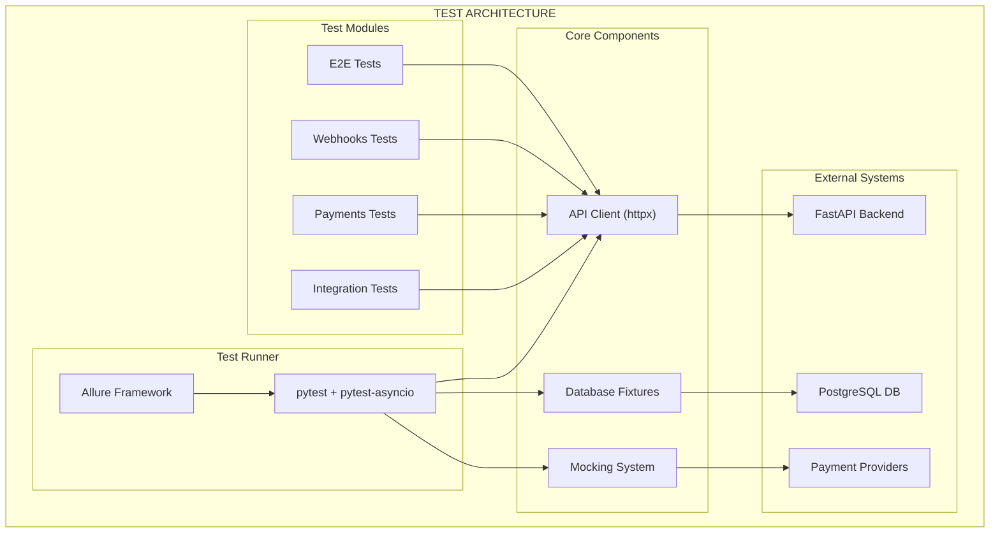

# 🎨🎨🎨 ENTERING CREATIVE PHASE: ARCHITECTURE DESIGN 🎨🎨🎨

## 🏗️ ТВОРЧЕСКАЯ ФАЗА 1: АРХИТЕКТУРА ТЕСТОВОЙ СИСТЕМЫ

### 📋 ПРОБЛЕМА И ТРЕБОВАНИЯ

**Контекст:**
- Необходимо создать систему автотестирования для VPN сервиса
- 180+ API эндпоинтов, из которых активно используется только 5
- Сложная архитектура с FastAPI, PostgreSQL, внешними платежными системами
- Требуется быстрый старт с 1-3 тестами для проверки подхода

**Ключевые требования:**
1. **Быстрый старт** - начать с 1-3 критических тестов
2. **Масштабируемость** - легко добавлять новые тесты
3. **Изоляция** - тесты не влияют друг на друга
4. **Отчетность** - красивые отчеты с Allure
5. **Производительность** - быстрые тесты (< 5 минут)
6. **Поддерживаемость** - понятная структура и документация

### 🎯 АНАЛИЗ КОМПОНЕНТОВ

**Основные компоненты системы:**
1. **Test Runner** - pytest с async поддержкой
2. **HTTP Client** - httpx для API запросов
3. **Database Fixtures** - изолированные тестовые данные
4. **Mocking System** - моки для внешних сервисов
5. **Reporting Engine** - Allure интеграция
6. **Configuration** - настройки тестового окружения

### 🔄 АРХИТЕКТУРНЫЕ ВАРИАНТЫ

#### Вариант 1: Монолитная структура (Простой старт)

**Описание:**
- Все тесты в одной директории
- Простые фикстуры без сложной абстракции
- Прямые HTTP запросы к API
- Минимальная настройка

**Структура:**
```
tests/
├── conftest.py          # Базовые фикстуры
├── test_integration.py  # Тесты integration API
├── test_payments.py     # Тесты payments API
├── test_webhooks.py     # Тесты webhooks
└── utils/
    ├── api_client.py    # HTTP клиент
    └── test_data.py     # Тестовые данные
```

**Плюсы:**
- ✅ Быстрый старт (1-2 часа)
- ✅ Простота понимания
- ✅ Минимальные зависимости
- ✅ Легко отладить

**Минусы:**
- ❌ Не масштабируется
- ❌ Дублирование кода
- ❌ Сложно поддерживать при росте
- ❌ Нет переиспользования

**Сложность:** Низкая
**Время реализации:** 1-2 дня

#### Вариант 2: Модульная архитектура (Рекомендуемая)

**Описание:**
- Разделение по доменам (integration, payments, webhooks)
- Переиспользуемые фикстуры и утилиты
- Абстракции для API клиентов
- Четкая структура и документация

**Структура:**
```
tests/
├── conftest.py              # Общие фикстуры
├── fixtures/
│   ├── database.py          # БД фикстуры
│   ├── api_client.py        # API клиент фикстуры
│   └── mocks.py             # Моки внешних сервисов
├── utils/
│   ├── api_client.py        # Базовый API клиент
│   ├── test_data.py         # Генераторы тестовых данных
│   └── assertions.py        # Кастомные проверки
├── integration/
│   ├── test_user_dashboard.py
│   ├── test_full_cycle.py
│   └── test_app_settings.py
├── payments/
│   ├── test_create_payment.py
│   └── test_payment_status.py
├── webhooks/
│   ├── test_yookassa.py
│   ├── test_freekassa.py
│   └── test_robokassa.py
└── e2e/
    └── test_user_journey.py
```

**Плюсы:**
- ✅ Хорошо масштабируется
- ✅ Переиспользование кода
- ✅ Четкая организация
- ✅ Легко поддерживать
- ✅ Подходит для команды

**Минусы:**
- ❌ Больше начальных затрат
- ❌ Сложнее для понимания новичками
- ❌ Больше файлов и структуры

**Сложность:** Средняя
**Время реализации:** 3-4 дня

#### Вариант 3: Микросервисная архитектура (Избыточная)

**Описание:**
- Отдельные тестовые сервисы для каждого домена
- Собственные базы данных для каждого модуля
- Сложная система оркестрации тестов
- Docker контейнеры для изоляции

**Структура:**
```
tests/
├── docker-compose.test.yml
├── services/
│   ├── integration-tests/
│   ├── payments-tests/
│   └── webhooks-tests/
├── shared/
│   ├── test-utils/
│   └── test-config/
└── orchestrator/
    └── test-runner.py
```

**Плюсы:**
- ✅ Максимальная изоляция
- ✅ Параллельное выполнение
- ✅ Независимое развитие модулей

**Минусы:**
- ❌ Избыточная сложность
- ❌ Много времени на настройку
- ❌ Сложно отлаживать
- ❌ Не подходит для быстрого старта

**Сложность:** Высокая
**Время реализации:** 1-2 недели

### 🎯 РЕКОМЕНДУЕМОЕ РЕШЕНИЕ

**Выбранный вариант:** Вариант 2 (Модульная архитектура) с гибридным подходом

**Обоснование:**
1. **Быстрый старт** - можно начать с простой структуры и эволюционировать
2. **Масштабируемость** - подходит для роста проекта
3. **Практичность** - баланс между простотой и функциональностью
4. **Соответствие требованиям** - покрывает все ключевые потребности

### 🏗️ ДЕТАЛЬНАЯ АРХИТЕКТУРА

#### Структура проекта:
```
tests/
├── conftest.py                  # Общие фикстуры pytest
├── pytest.ini                  # Конфигурация pytest
├── requirements-test.txt        # Зависимости для тестов
├── fixtures/
│   ├── __init__.py
│   ├── database.py             # Фикстуры БД
│   ├── api_client.py           # Фикстуры API клиента
│   ├── test_data.py            # Генераторы тестовых данных
│   └── mocks.py                # Моки внешних сервисов
├── utils/
│   ├── __init__.py
│   ├── api_client.py           # Базовый HTTP клиент
│   ├── test_data.py            # Утилиты для тестовых данных
│   ├── assertions.py           # Кастомные проверки
│   └── allure_utils.py         # Утилиты для Allure
├── integration/
│   ├── __init__.py
│   ├── test_user_dashboard.py  # Тест user-dashboard API
│   ├── test_full_cycle.py      # Тест full-cycle API
│   └── test_app_settings.py    # Тест app-settings API
├── payments/
│   ├── __init__.py
│   ├── test_create_payment.py  # Тест создания платежа
│   └── test_payment_status.py  # Тест статуса платежа
├── webhooks/
│   ├── __init__.py
│   ├── test_yookassa.py        # Тест YooKassa webhook
│   ├── test_freekassa.py       # Тест FreeKassa webhook
│   └── test_robokassa.py       # Тест Robokassa webhook
└── e2e/
    ├── __init__.py
    └── test_user_journey.py    # E2E тест пользовательского пути
```

#### Ключевые компоненты:

**1. API Client (utils/api_client.py):**
```python
class APIClient:
    def __init__(self, base_url: str):
        self.base_url = base_url
        self.session = httpx.AsyncClient()
    
    async def get(self, endpoint: str, **kwargs):
        return await self.session.get(f"{self.base_url}{endpoint}", **kwargs)
    
    async def post(self, endpoint: str, **kwargs):
        return await self.session.post(f"{self.base_url}{endpoint}", **kwargs)
```

**2. Database Fixtures (fixtures/database.py):**
```python
@pytest.fixture
async def db_session():
    # Создание изолированной сессии БД для теста
    async with get_test_db_session() as session:
        yield session
        await session.rollback()  # Откат изменений
```

**3. Test Data Generators (fixtures/test_data.py):**
```python
@pytest.fixture
def sample_user_data():
    return {
        "telegram_id": 123456789,
        "username": "test_user",
        "first_name": "Test"
    }
```

### 🎨 CREATIVE CHECKPOINT: АРХИТЕКТУРНАЯ ДИАГРАММА



### 📋 ПЛАН РЕАЛИЗАЦИИ

#### Этап 1: Базовая инфраструктура (1 день)
1. **Создание структуры директорий**
2. **Настройка pytest конфигурации**
3. **Базовый API клиент**
4. **Простые фикстуры**

#### Этап 2: Первые 3 теста (1 день)
1. **`GET /api/v1/integration/user-dashboard/{telegram_id}`**
2. **`POST /api/v1/integration/full-cycle`**
3. **`GET /api/v1/integration/app-settings`**

#### Этап 3: Интеграция с Allure (0.5 дня)
1. **Настройка Allure**
2. **Базовые отчеты**
3. **Кастомные метрики**

#### Этап 4: Расширение (1-2 дня)
1. **Добавление остальных тестов**
2. **Улучшение фикстур**
3. **Документация**

### ⚠️ ВЫЗОВЫ И РЕШЕНИЯ

**Вызов 1: Асинхронное тестирование**
- **Проблема:** FastAPI использует async/await
- **Решение:** pytest-asyncio + правильные фикстуры

**Вызов 2: Изоляция тестов**
- **Проблема:** Тесты влияют друг на друга через БД
- **Решение:** Транзакции + откат после каждого теста

**Вызов 3: Внешние зависимости**
- **Проблема:** Платежные системы недоступны в тестах
- **Решение:** Моки + тестовые webhook'и

**Вызов 4: Быстрый старт**
- **Проблема:** Нужно быстро проверить подход
- **Решение:** Начать с простой структуры + эволюционировать

### ✅ ВАЛИДАЦИЯ АРХИТЕКТУРЫ

**Проверка требований:**
- ✅ **Быстрый старт** - можно начать за 1 день
- ✅ **Масштабируемость** - модульная структура
- ✅ **Изоляция** - фикстуры с откатом
- ✅ **Отчетность** - Allure интеграция
- ✅ **Производительность** - асинхронные тесты
- ✅ **Поддерживаемость** - четкая структура

**Техническая осуществимость:**
- ✅ **pytest** - проверенная технология
- ✅ **httpx** - современный async HTTP клиент
- ✅ **Allure** - мощная система отчетности
- ✅ **PostgreSQL** - изоляция через транзакции

🎨🎨🎨 EXITING CREATIVE PHASE - АРХИТЕКТУРА ОПРЕДЕЛЕНА 🎨🎨🎨 