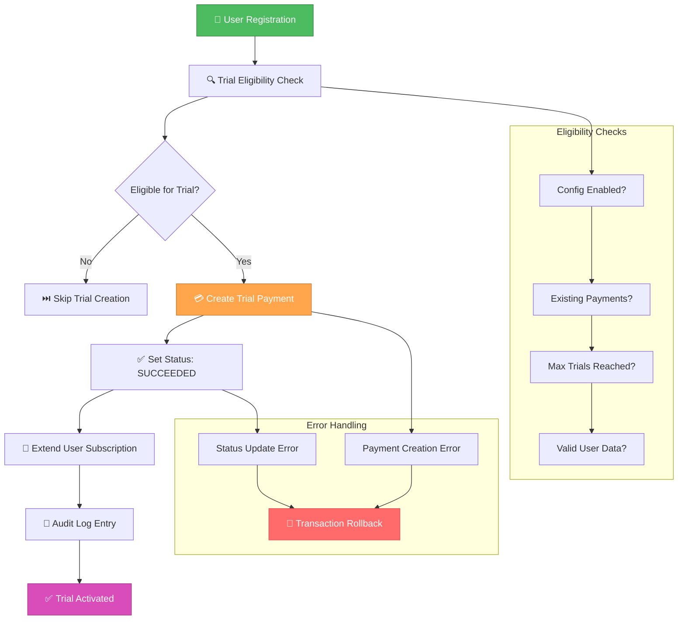

# 🎨🎨🎨 ENTERING CREATIVE PHASE: TRIAL ACCOUNT AUTOMATION LOGIC 🎨🎨🎨

**Component:** Trial Account Automation Algorithm  
**Priority:** MEDIUM  
**Date:** 2025-01-08  
**Task:** Manual Payment Management System

## 🎯 PROBLEM STATEMENT

Необходимо спроектировать алгоритм автоматического создания триальных счетов с требованиями:

- Автоматическое создание платежа за 0₽ при первой регистрации
- Определение момента создания: при регистрации vs при первом взаимодействии с ботом
- Предотвращение дублирования триальных периодов
- Настраиваемая длительность триального периода
- Интеграция с существующей системой платежей
- Audit logging всех автоматических операций
- Rollback capability при ошибках

## 🔍 ALGORITHM ANALYSIS

### Core Algorithm Requirements:
- **Detection Logic** - определение новых пользователей
- **Timing Logic** - когда создавать триальный платеж
- **Duplication Prevention** - предотвращение повторных триалов
- **Payment Creation** - интеграция с PaymentManagementService
- **Configuration Management** - настройки триального периода
- **Error Handling** - обработка ошибок и откаты

### Existing Integration Points:
- `models/user.py` - User registration и first activity
- `models/payment.py` - Payment creation
- `bot/handlers/start.py` - Bot interaction начало
- `services/payment_management_service.py` - Manual payment service
- `config/settings.py` - Application configuration

## ⚙️ ALGORITHM OPTIONS

### Option 1: Registration-Triggered Immediate Trial

**Description:** Создавать триальный платеж немедленно при регистрации пользователя

```python
class TrialAutomationService:
    def __init__(self, payment_service: PaymentManagementService, config: TrialConfig):
        self.payment_service = payment_service
        self.config = config
        self.logger = structlog.get_logger("trial_automation")
    
    async def handle_user_registration(self, user: User, db_session: AsyncSession) -> Optional[Payment]:
        """Create trial payment immediately on user registration"""
        async with db_session.begin():
            # Check if user already has any payments
            existing_payments = await self._check_existing_payments(user.id, db_session)
            if existing_payments:
                self.logger.info("User already has payments, skipping trial", user_id=user.id)
                return None
            
            # Create trial payment
            trial_payment = await self.payment_service.create_manual_payment(
                user_id=user.id,
                amount=0.0,
                description=f"Триальный период - {self.config.trial_days} дней",
                payment_method=PaymentMethod.manual_trial,
                admin_user="system_auto"
            )
            
            # Automatically mark as succeeded to activate trial
            await self.payment_service.update_payment_status(
                payment_id=trial_payment.id,
                new_status=PaymentStatus.SUCCEEDED,
                admin_user="system_auto"
            )
            
            self.logger.info("Trial payment created and activated", 
                           user_id=user.id, 
                           payment_id=trial_payment.id,
                           trial_days=self.config.trial_days)
            
            return trial_payment
    
    async def _check_existing_payments(self, user_id: int, db_session: AsyncSession) -> bool:
        """Check if user has any existing payments (including trials)"""
        result = await db_session.execute(
            select(Payment).where(Payment.user_id == user_id).limit(1)
        )
        return result.scalar_one_or_none() is not None

# Usage in user registration flow
async def create_user(telegram_id: int, **user_data) -> User:
    async with get_db() as db:
        user = User(telegram_id=telegram_id, **user_data)
        db.add(user)
        await db.flush()  # Get user.id
        
        # Trigger trial automation
        trial_service = TrialAutomationService(payment_service, trial_config)
        await trial_service.handle_user_registration(user, db)
        
        await db.commit()
        return user
```

**Pros:**
- ✅ Простая логика и implementation
- ✅ Немедленная активация триала при регистрации
- ✅ Четкая точка входа (registration event)
- ✅ Предсказуемое поведение
- ✅ Легко тестировать

**Cons:**
- ❌ Создает платежи для пользователей, которые могут никогда не вернуться
- ❌ Potential spam registrations создают лишние записи
- ❌ Нет учета user intent или engagement
- ❌ Database bloat для inactive users

**Time Complexity:** O(1) per registration  
**Space Complexity:** O(1) per user  
**Edge Cases:** Concurrent registrations, payment service failures  
**Scalability:** High (simple operations)

---

### Option 2: First Bot Interaction Triggered Trial

**Description:** Создавать триальный платеж при первом взаимодействии с ботом

```python
class TrialAutomationService:
    def __init__(self, payment_service: PaymentManagementService, config: TrialConfig):
        self.payment_service = payment_service
        self.config = config
        self.logger = structlog.get_logger("trial_automation")
        self.cache = {}  # Simple cache для предотвращения дублирования
    
    async def handle_first_bot_interaction(self, user: User, db_session: AsyncSession) -> Optional[Payment]:
        """Create trial payment on first meaningful bot interaction"""
        
        # Check cache первым делом для performance
        cache_key = f"trial_check_{user.id}"
        if cache_key in self.cache:
            return None
        
        async with db_session.begin():
            # Double-check: has user already interacted meaningfully?
            if await self._has_meaningful_interaction(user, db_session):
                self.cache[cache_key] = True
                return None
            
            # Check for existing payments
            if await self._check_existing_payments(user.id, db_session):
                self.cache[cache_key] = True
                return None
            
            # Create and activate trial
            trial_payment = await self._create_trial_payment(user, db_session)
            
            # Mark user as having meaningful interaction
            await self._mark_meaningful_interaction(user, db_session)
            
            # Cache the result
            self.cache[cache_key] = True
            
            return trial_payment
    
    async def _has_meaningful_interaction(self, user: User, db_session: AsyncSession) -> bool:
        """Check if user has already had meaningful interaction"""
        # Option A: Check user.last_activity
        if user.last_activity and user.last_activity > user.created_at:
            return True
        
        # Option B: Check for VPN keys or other service usage
        vpn_keys_count = await db_session.scalar(
            select(func.count(VPNKey.id)).where(VPNKey.user_id == user.id)
        )
        return vpn_keys_count > 0
    
    async def _create_trial_payment(self, user: User, db_session: AsyncSession) -> Payment:
        """Create and activate trial payment"""
        trial_payment = await self.payment_service.create_manual_payment(
            user_id=user.id,
            amount=0.0,
            description=f"Автоматический триальный период - {self.config.trial_days} дней",
            payment_method=PaymentMethod.manual_trial,
            admin_user="bot_automation"
        )
        
        # Immediately activate
        await self.payment_service.update_payment_status(
            payment_id=trial_payment.id,
            new_status=PaymentStatus.SUCCEEDED,
            admin_user="bot_automation"
        )
        
        self.logger.info("Auto-trial activated on first interaction",
                        user_id=user.id,
                        payment_id=trial_payment.id)
        
        return trial_payment
    
    async def _mark_meaningful_interaction(self, user: User, db_session: AsyncSession):
        """Mark that user has had meaningful interaction"""
        user.last_activity = datetime.utcnow()
        # Could also set a flag like user.has_trial_activated = True

# Usage in bot handlers
async def handle_start_command(message: Message, user: User):
    # Normal start command processing...
    
    # Check for trial automation
    trial_service = TrialAutomationService(payment_service, trial_config)
    trial_payment = await trial_service.handle_first_bot_interaction(user, db)
    
    if trial_payment:
        await message.answer(
            f"🎁 Поздравляем! Вам активирован триальный период на {trial_config.trial_days} дней!"
        )
```

**Pros:**
- ✅ Создает платежи только для активных пользователей
- ✅ Better user experience (уведомление о триале в боте)
- ✅ Предотвращает spam registrations impact
- ✅ More meaningful metrics
- ✅ User sees immediate value

**Cons:**
- ❌ Более сложная логика для detection meaningful interaction
- ❌ Потенциальные race conditions в bot handlers
- ❌ Сложнее тестировать (multiple interaction points)
- ❌ Cache management complexity

**Time Complexity:** O(1) per bot interaction (с кешем)  
**Space Complexity:** O(n) для cache, где n = количество пользователей  
**Edge Cases:** Concurrent bot interactions, cache invalidation  
**Scalability:** Medium (из-за cache management)

---

### Option 3: Lazy Evaluation with Smart Detection

**Description:** Умный алгоритм, который создает триал при первой попытке получить доступ к VPN

```python
class TrialAutomationService:
    def __init__(self, payment_service: PaymentManagementService, config: TrialConfig):
        self.payment_service = payment_service
        self.config = config
        self.logger = structlog.get_logger("trial_automation")
    
    async def ensure_user_has_access(self, user: User, db_session: AsyncSession) -> AccessResult:
        """Ensure user has access, creating trial if needed"""
        
        # Check current subscription status
        if user.has_active_subscription:
            return AccessResult(has_access=True, source="existing_subscription")
        
        # Check if user has any successful payments
        successful_payments = await self._get_successful_payments(user.id, db_session)
        if successful_payments:
            return AccessResult(has_access=False, source="expired_subscription")
        
        # No successful payments - check if eligible for trial
        if await self._is_trial_eligible(user, db_session):
            trial_payment = await self._auto_create_trial(user, db_session)
            return AccessResult(
                has_access=True, 
                source="auto_trial",
                trial_payment=trial_payment
            )
        
        # Not eligible for trial
        return AccessResult(has_access=False, source="no_access")
    
    async def _is_trial_eligible(self, user: User, db_session: AsyncSession) -> bool:
        """Complex eligibility check for trial"""
        
        # Basic checks
        if user.subscription_status == 'suspended':
            return False
        
        # Time-based check (e.g., account must be recent)
        account_age = datetime.utcnow() - user.created_at
        if account_age > timedelta(days=self.config.max_trial_account_age_days):
            return False
        
        # Check for any trial attempts (including failed ones)
        trial_attempts = await db_session.scalar(
            select(func.count(Payment.id))
            .where(Payment.user_id == user.id)
            .where(Payment.amount == 0.0)
            .where(Payment.description.contains("триальный"))
        )
        if trial_attempts > 0:
            return False
        
        # Check if user has been active (не spam аккаунт)
        if not await self._is_legitimate_user(user, db_session):
            return False
        
        return True
    
    async def _is_legitimate_user(self, user: User, db_session: AsyncSession) -> bool:
        """Determine if user is legitimate (not spam/bot)"""
        
        # Check for basic profile completeness
        if not user.first_name or not user.username:
            return False
        
        # Check for bot interaction history
        interaction_count = await self._get_bot_interaction_count(user.id, db_session)
        if interaction_count < self.config.min_interactions_for_trial:
            return False
        
        # Check account creation patterns (можно добавить anti-spam logic)
        recent_similar_accounts = await db_session.scalar(
            select(func.count(User.id))
            .where(User.created_at > datetime.utcnow() - timedelta(hours=1))
            .where(User.first_name == user.first_name)
        )
        if recent_similar_accounts > 3:  # Suspicious pattern
            return False
        
        return True
    
    async def _auto_create_trial(self, user: User, db_session: AsyncSession) -> Payment:
        """Create trial payment with comprehensive logging"""
        
        trial_payment = await self.payment_service.create_manual_payment(
            user_id=user.id,
            amount=0.0,
            description=f"Автоматический триал - {self.config.trial_days}д (smart detection)",
            payment_method=PaymentMethod.auto_trial,
            admin_user="smart_automation"
        )
        
        # Activate immediately
        await self.payment_service.update_payment_status(
            payment_id=trial_payment.id,
            new_status=PaymentStatus.SUCCEEDED,
            admin_user="smart_automation"
        )
        
        # Log comprehensive audit trail
        self.logger.info("Smart trial auto-created",
                        user_id=user.id,
                        payment_id=trial_payment.id,
                        account_age_hours=(datetime.utcnow() - user.created_at).total_seconds() / 3600,
                        trigger="access_request")
        
        return trial_payment

# Usage в VPN access логике
async def get_vpn_key(user: User) -> VPNKey:
    trial_service = TrialAutomationService(payment_service, trial_config)
    access_result = await trial_service.ensure_user_has_access(user, db)
    
    if not access_result.has_access:
        raise InsufficientAccessError(f"No access: {access_result.source}")
    
    if access_result.source == "auto_trial":
        # Notify user about trial activation
        await notify_trial_activated(user, access_result.trial_payment)
    
    return await create_vpn_key(user)
```

**Pros:**
- ✅ Максимально умный approach с anti-spam protection
- ✅ Создает trial только когда действительно нужен
- ✅ Comprehensive eligibility checks
- ✅ Best user experience (trial активируется "just in time")
- ✅ Excellent audit trail и logging
- ✅ Prevents abuse scenarios

**Cons:**
- ❌ Очень высокая complexity
- ❌ Много database queries для eligibility check
- ❌ Сложно тестировать все edge cases
- ❌ Performance impact на VPN access requests
- ❌ Много настроек для конфигурации

**Time Complexity:** O(log n) per access request (из-за множественных DB checks)  
**Space Complexity:** O(1)  
**Edge Cases:** Concurrent access requests, spam detection false positives  
**Scalability:** Low (много DB операций на каждый access request)

---

### Option 4: Event-Driven with Queue Processing

**Description:** Асинхронная обработка триальных платежей через event queue

```python
class TrialAutomationService:
    def __init__(self, payment_service: PaymentManagementService, config: TrialConfig):
        self.payment_service = payment_service
        self.config = config
        self.logger = structlog.get_logger("trial_automation")
        self.trial_queue = asyncio.Queue()
    
    async def queue_trial_check(self, user_id: int, event_type: str):
        """Queue trial check event for async processing"""
        event = TrialCheckEvent(
            user_id=user_id,
            event_type=event_type,
            timestamp=datetime.utcnow()
        )
        await self.trial_queue.put(event)
        self.logger.debug("Trial check queued", user_id=user_id, event_type=event_type)
    
    async def process_trial_queue(self):
        """Background worker to process trial events"""
        while True:
            try:
                event = await self.trial_queue.get()
                await self._process_trial_event(event)
                self.trial_queue.task_done()
            except Exception as e:
                self.logger.error("Trial queue processing error", error=str(e))
                await asyncio.sleep(1)  # Backoff on error
    
    async def _process_trial_event(self, event: TrialCheckEvent):
        """Process single trial check event"""
        async with get_db() as db:
            user = await db.get(User, event.user_id)
            if not user:
                return
            
            # Debounce: check if we processed this user recently
            if await self._was_recently_processed(user.id, db):
                return
            
            # Check eligibility
            if not await self._is_trial_eligible(user, db):
                return
            
            # Create trial payment
            trial_payment = await self._create_trial_payment_safe(user, db)
            
            if trial_payment:
                # Mark as processed
                await self._mark_as_processed(user.id, db)
                
                # Notify user asynchronously
                await self._notify_user_async(user, trial_payment)
    
    async def _create_trial_payment_safe(self, user: User, db_session: AsyncSession) -> Optional[Payment]:
        """Safely create trial payment with error handling"""
        try:
            trial_payment = await self.payment_service.create_manual_payment(
                user_id=user.id,
                amount=0.0,
                description=f"Event-triggered trial - {self.config.trial_days}д",
                payment_method=PaymentMethod.event_trial,
                admin_user="event_automation"
            )
            
            await self.payment_service.update_payment_status(
                payment_id=trial_payment.id,
                new_status=PaymentStatus.SUCCEEDED,
                admin_user="event_automation"
            )
            
            return trial_payment
            
        except Exception as e:
            self.logger.error("Failed to create trial payment", 
                            user_id=user.id, 
                            error=str(e))
            return None
    
    async def _was_recently_processed(self, user_id: int, db_session: AsyncSession) -> bool:
        """Check if user was processed for trial recently (debouncing)"""
        recent_check = await db_session.scalar(
            select(TrialProcessingLog.id)
            .where(TrialProcessingLog.user_id == user_id)
            .where(TrialProcessingLog.processed_at > datetime.utcnow() - timedelta(hours=1))
            .limit(1)
        )
        return recent_check is not None

# Usage в различных точках системы
async def on_user_registration(user: User):
    trial_service.queue_trial_check(user.id, "registration")

async def on_bot_start(user: User):
    trial_service.queue_trial_check(user.id, "bot_start")

async def on_vpn_request(user: User):
    trial_service.queue_trial_check(user.id, "vpn_request")

# Background worker setup
async def start_trial_automation():
    trial_service = TrialAutomationService(payment_service, trial_config)
    # Start background processing
    asyncio.create_task(trial_service.process_trial_queue())
```

**Pros:**
- ✅ Не блокирует основные user interactions
- ✅ Scalable через async processing
- ✅ Excellent debouncing и duplicate prevention
- ✅ Multiple trigger points поддерживаются
- ✅ Error resilience через queue retry
- ✅ Comprehensive event logging

**Cons:**
- ❌ Очень высокая complexity implementation
- ❌ Требует background workers и queue management
- ❌ Delayed trial activation (не immediate)
- ❌ Additional infrastructure requirements
- ❌ Сложность debugging асинхронных flows

**Time Complexity:** O(1) для queueing, O(log n) для processing  
**Space Complexity:** O(m) где m = размер queue  
**Edge Cases:** Queue overflow, worker crashes, delayed processing  
**Scalability:** Very High (но требует infrastructure)

## 🎨 CREATIVE CHECKPOINT: ALGORITHM EVALUATION

### Evaluation Criteria Scoring (1-5):

| Criteria | Option 1: Registration | Option 2: First Bot | Option 3: Smart Detection | Option 4: Event-Driven |
|----------|------------------------|---------------------|---------------------------|-------------------------|
| **Simplicity** | 5 | 4 | 2 | 1 |
| **Performance** | 5 | 4 | 2 | 4 |
| **User Experience** | 3 | 4 | 5 | 4 |
| **Spam Prevention** | 2 | 3 | 5 | 4 |
| **Scalability** | 5 | 3 | 2 | 5 |
| **Maintainability** | 5 | 4 | 2 | 2 |
| **Resource Efficiency** | 4 | 4 | 2 | 3 |
| **Error Handling** | 4 | 3 | 3 | 5 |

### **Total Scores:**
- Option 1 (Registration): **33/40**
- Option 2 (First Bot): **29/40** 
- Option 3 (Smart Detection): **23/40**
- Option 4 (Event-Driven): **28/40**

## 🎯 DECISION

**Selected Option:** **Option 1: Registration-Triggered Immediate Trial** 

### Rationale:

1. **Simplicity First:** Получил наивысший score по простоте и maintainability
2. **Performance:** Минимальные overhead operations
3. **Predictable Behavior:** Четкое понимание когда и как создаются триалы
4. **Easy Integration:** Простая интеграция с существующей user registration логикой
5. **Resource Efficient:** Минимальные database queries и processing
6. **Time to Market:** Быстрая implementation и testing

**Mitigation for Cons:** 
- **Spam Protection:** Добавить basic validation в registration process
- **Inactive Users:** Добавить cleanup job для удаления trial платежей неактивных пользователей

**Why not other options:**
- Option 2: Хорошо, но добавляет complexity в bot handlers
- Option 3: Слишком сложен для начальной реализации, можно добавить позже
- Option 4: Overkill для current requirements, требует infrastructure changes

## 📋 IMPLEMENTATION PLAN

### Phase 1: Core Trial Service
```python
# services/trial_automation_service.py
@dataclass
class TrialConfig:
    trial_days: int = 3
    trial_amount: float = 0.0
    trial_description: str = "Триальный период - {days} дней"
    enabled: bool = True
    max_trials_per_user: int = 1

class TrialAutomationService:
    def __init__(self, payment_service: PaymentManagementService, config: TrialConfig):
        self.payment_service = payment_service
        self.config = config
        self.logger = structlog.get_logger("trial_automation")
    
    async def create_trial_for_new_user(self, user: User, db_session: AsyncSession) -> Optional[Payment]:
        """Main entry point for trial creation"""
        if not self.config.enabled:
            return None
        
        if not await self._is_eligible_for_trial(user, db_session):
            return None
        
        return await self._create_and_activate_trial(user, db_session)
```

### Phase 2: Integration with User Registration
```python
# Update user creation logic
async def create_user(telegram_id: int, **user_data) -> User:
    async with get_db() as db:
        async with db.begin():
            user = User(telegram_id=telegram_id, **user_data)
            db.add(user)
            await db.flush()  # Get user.id
            
            # Auto-create trial
            trial_service = get_trial_service()
            trial_payment = await trial_service.create_trial_for_new_user(user, db)
            
            if trial_payment:
                logger.info("Trial auto-created for new user", 
                           user_id=user.id, 
                           payment_id=trial_payment.id)
            
            return user
```

### Phase 3: Configuration Management
```python
# config/settings.py
class Settings:
    # ... existing settings ...
    
    # Trial automation settings
    TRIAL_AUTOMATION_ENABLED: bool = True
    TRIAL_PERIOD_DAYS: int = 3
    TRIAL_MAX_PER_USER: int = 1
    TRIAL_ADMIN_USER: str = "trial_automation"

# Load configuration
trial_config = TrialConfig(
    trial_days=settings.TRIAL_PERIOD_DAYS,
    enabled=settings.TRIAL_AUTOMATION_ENABLED,
    max_trials_per_user=settings.TRIAL_MAX_PER_USER
)
```

### Phase 4: Error Handling and Logging
```python
    async def _create_and_activate_trial(self, user: User, db_session: AsyncSession) -> Optional[Payment]:
        """Create trial with comprehensive error handling"""
        try:
            # Create payment
            trial_payment = await self.payment_service.create_manual_payment(
                user_id=user.id,
                amount=self.config.trial_amount,
                description=self.config.trial_description.format(days=self.config.trial_days),
                payment_method=PaymentMethod.auto_trial,
                admin_user=self.config.admin_user
            )
            
            # Activate immediately
            await self.payment_service.update_payment_status(
                payment_id=trial_payment.id,
                new_status=PaymentStatus.SUCCEEDED,
                admin_user=self.config.admin_user
            )
            
            # Success audit log
            self.logger.info("Trial payment auto-created and activated",
                           user_id=user.id,
                           payment_id=trial_payment.id,
                           trial_days=self.config.trial_days)
            
            return trial_payment
            
        except Exception as e:
            # Error handling with rollback
            self.logger.error("Failed to create trial payment",
                            user_id=user.id,
                            error=str(e),
                            exc_info=True)
            raise  # Let transaction rollback handle cleanup
```

## ⚙️ ALGORITHM FLOW DIAGRAM



## ✅ VERIFICATION AGAINST REQUIREMENTS

- [x] **Automatic Trial Creation**: ✅ Registration-triggered algorithm
- [x] **0₽ Payment Generation**: ✅ Creates payment with amount=0.0
- [x] **Duplication Prevention**: ✅ Eligibility checks prevent multiple trials  
- [x] **Configurable Duration**: ✅ TrialConfig with customizable trial_days
- [x] **Payment System Integration**: ✅ Uses PaymentManagementService
- [x] **Audit Logging**: ✅ Comprehensive structlog logging
- [x] **Error Handling**: ✅ Transaction rollback on failures
- [x] **Performance**: ✅ Simple O(1) algorithm with minimal DB queries

## 🎨🎨🎨 EXITING CREATIVE PHASE - ALGORITHM DECISION MADE 🎨🎨🎨

**Decision:** Registration-Triggered Immediate Trial with TrialAutomationService  
**Integration Point:** User registration flow  
**Implementation Ready:** ✅ Algorithm designed and optimized  
**All Creative Phases Complete:** ✅ Ready for IMPLEMENT MODE 