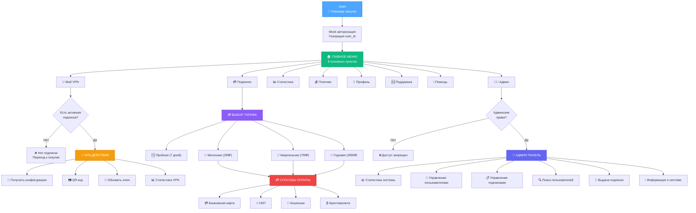
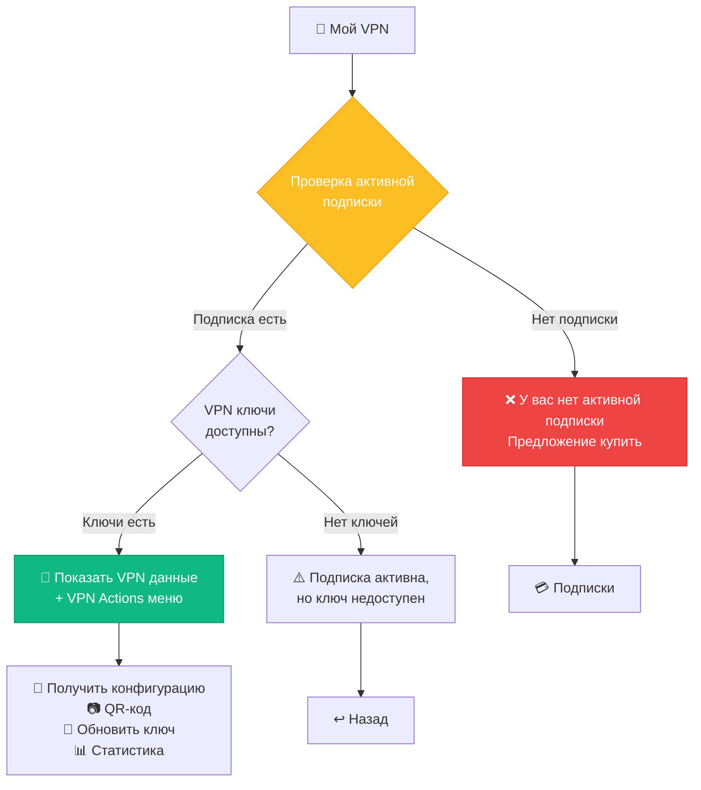
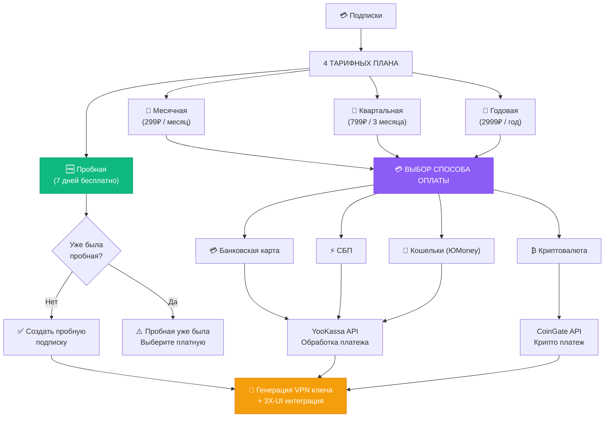
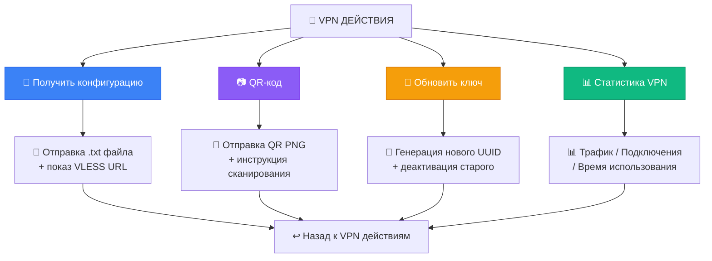
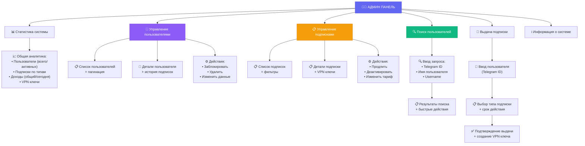
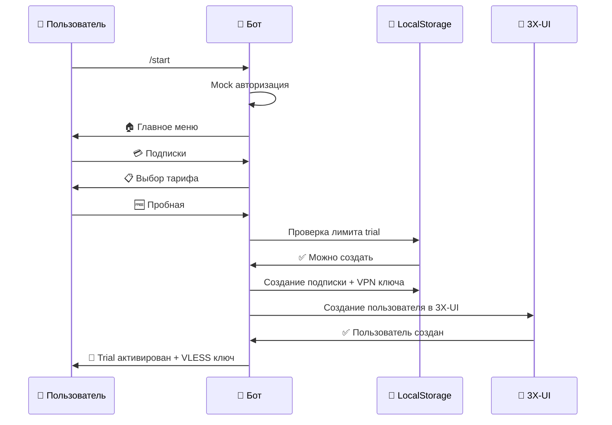
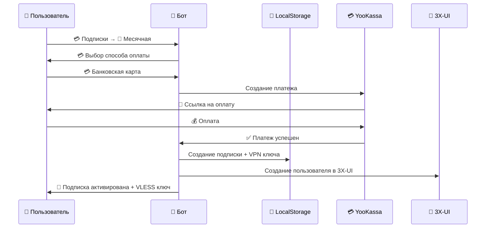
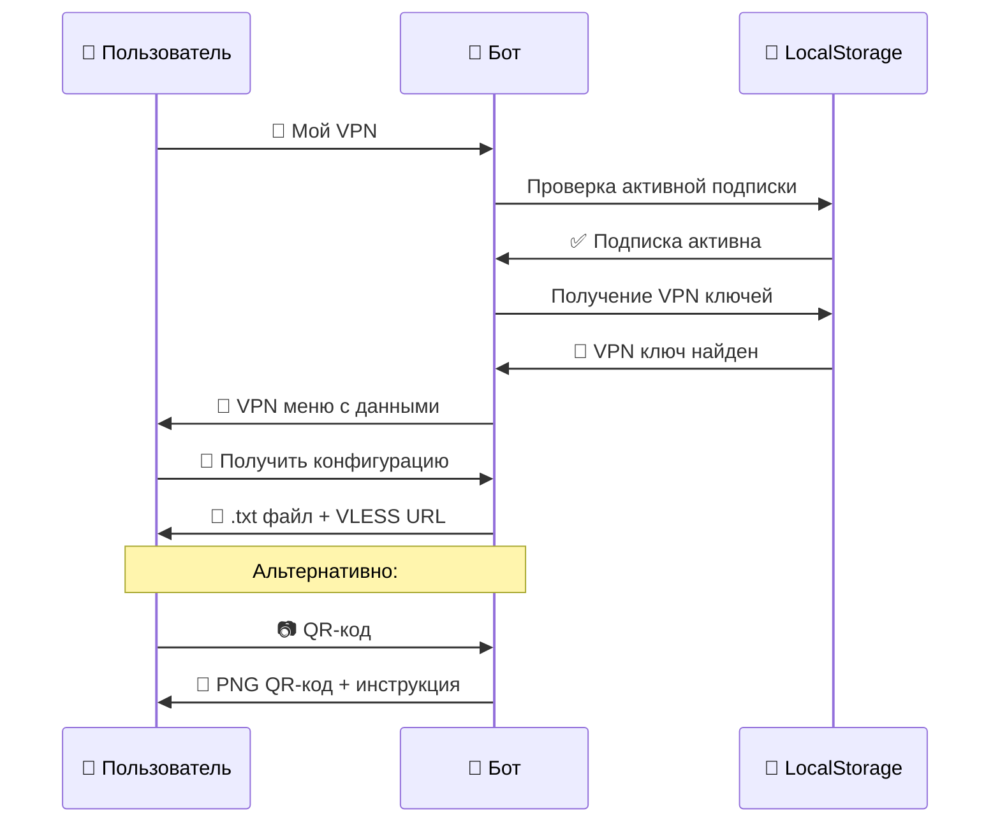

# VPN Telegram Bot - Полная схема меню и навигации

## 🗺️ ОБЩАЯ СТРУКТУРА НАВИГАЦИИ



## 🏠 ГЛАВНОЕ МЕНЮ - Детальная структура

### 1. 🔐 Мой VPN
**Handler**: `menu.py:my_vpn_handler`  
**Callback**: `"my_vpn"`



### 2. 💳 Подписки
**Handler**: `subscriptions.py` (множественные handlers)  
**Callback**: `"subscriptions"`



### 3. 🔐 VPN Действия (VPN Actions Menu)
**Handler**: `vpn_actions.py`



### 4. 👨‍💻 Административная панель
**Handler**: `admin/admin_panel.py`, `admin/user_management.py`, `admin/subscription_management.py`



## 📱 ПОЛЬЗОВАТЕЛЬСКИЕ ПУТИ (User Journeys)

### 🆓 Путь нового пользователя (Trial)



### 💳 Путь покупки платной подписки



### 🔐 Путь использования VPN



## 🔧 ТЕХНИЧЕСКИЕ ДЕТАЛИ

### FSM States (Конечный автомат состояний)

```python
# AdminStates (admin/admin_panel.py)
class AdminStates(StatesGroup):
    waiting_for_search = State()      # Ожидание поискового запроса
    waiting_for_user_id = State()     # Ожидание ID пользователя
    users_menu = State()              # Меню пользователей
    users_list = State()              # Список пользователей
    user_detail = State()             # Детали пользователя
    subscriptions_menu = State()      # Меню подписок
    subscriptions_list = State()      # Список подписок
    subscription_detail = State()     # Детали подписки
    subscription_create = State()     # Создание подписки
```

### Callback Data Mapping

```python
# Основные callback'и главного меню
MAIN_MENU_CALLBACKS = {
    "my_vpn": "🔐 Мой VPN",
    "subscriptions": "💳 Подписки", 
    "statistics": "📊 Статистика",
    "payments": "💰 Платежи",
    "profile": "👤 Профиль",
    "support": "🆘 Поддержка",
    "help": "ℹ️ Помощь",
    "admin_panel": "👨‍💻 Админ"
}

# Подписки
SUBSCRIPTION_CALLBACKS = {
    "trial_subscription": "🆓 Пробная",
    "monthly_subscription": "📅 Месячная",
    "quarterly_subscription": "📅 Квартальная", 
    "yearly_subscription": "📅 Годовая"
}

# Способы оплаты
PAYMENT_CALLBACKS = {
    "payment_card": "💳 Банковская карта",
    "payment_sbp": "⚡ СБП", 
    "payment_yoomoney": "💼 ЮMoney",
    "payment_crypto": "₿ Криптовалюта"
}

# VPN действия
VPN_ACTION_CALLBACKS = {
    "get_config": "📱 Получить конфигурацию",
    "get_qr": "📷 QR-код",
    "regenerate_key": "🔄 Обновить ключ",
    "vpn_stats": "📊 Статистика VPN"
}

# Админские действия
ADMIN_CALLBACKS = {
    "admin_stats": "📊 Статистика системы",
    "admin_users": "👥 Управление пользователями",
    "admin_subscriptions": "📋 Управление подписками",
    "admin_user_search": "🔍 Поиск пользователей",
    "admin_give_subscription": "🎁 Выдача подписки",
    "admin_page_info": "ℹ️ Информация о системе"
}
```

### Навигационные кнопки

```python
# Системные кнопки возврата
NAVIGATION_CALLBACKS = {
    "back_to_main": "↩️ Главное меню",
    "back_to_subscriptions": "↩️ К подпискам", 
    "back_to_vpn": "↩️ К VPN действиям",
    "admin_back_to_menu": "↩️ Админ меню"
}
```

## 📊 СТАТИСТИКА СТРУКТУРЫ МЕНЮ

### Количественные показатели:
- **Всего пунктов главного меню**: 8
- **Всего callback handlers**: 45+
- **FSM состояний**: 9 (AdminStates)
- **Тарифных планов**: 4
- **Способов оплаты**: 4  
- **VPN действий**: 4
- **Админских функций**: 6
- **Файлов handlers**: 7
- **Keyboard модулей**: 2

### Глубина навигации:
- **Максимальная глубина**: 4 уровня (Главное меню → Подписки → Оплата → Подтверждение)
- **Среднее количество кликов до цели**: 2-3
- **Точек возврата**: 15+ кнопок "↩️ Назад"

## 🎯 РЕЗЮМЕ СТРУКТУРЫ

VPN Telegram бот имеет **хорошо структурированную навигацию** с четким разделением:

1. **Пользовательская часть**: Интуитивное управление подписками и VPN ключами
2. **Административная часть**: Полноценная система управления пользователями и подписками  
3. **Техническая часть**: Mock авторизация + LocalStorage + 3X-UI интеграция
4. **Платежная часть**: 4 способа оплаты через YooKassa и CoinGate

**Архитектура поддерживает**:
- ✅ Scalability (легко добавлять новые функции)
- ✅ Maintainability (четкое разделение по handlers)
- ✅ User Experience (логичная навигация)
- ✅ Admin Capabilities (полное управление системой) 